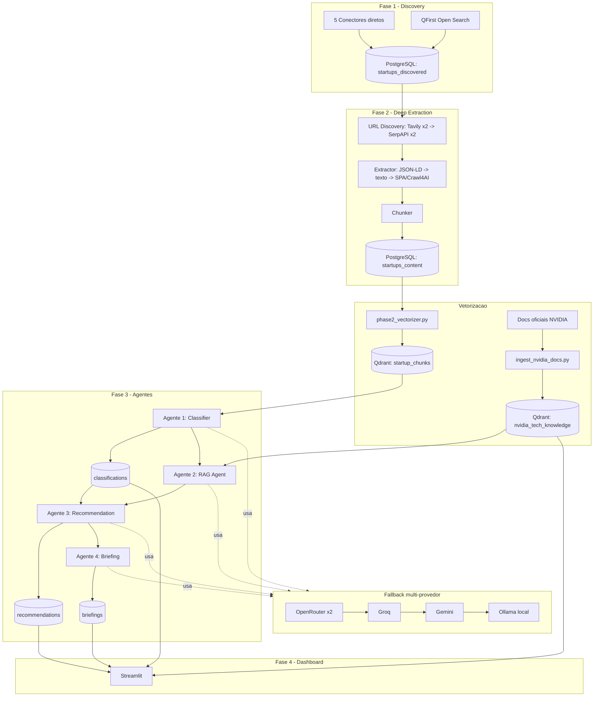

# NVIDIA Startup AI Radar


Plataforma multi-agente que mapeia startups brasileiras **AI-native**, classifica seu
grau de maturidade em IA e recomenda tecnologias NVIDIA (NIM, Triton, RAPIDS, NeMo,
Omniverse, Isaac, Clara, entre outras) com base em evidências reais coletadas dos
sites das próprias startups.

O pipeline combina scraping resiliente (multi-fonte, com fallback estático → SPA),
busca híbrida com reranking (RAG) sobre uma base de conhecimento NVIDIA vetorizada,
classificação e recomendação via LLM com fallback multi-provedor, e um dashboard
Streamlit para consumo por times de negócio (ex.: NVIDIA Inception).

## Índice

- [Features](#features)
- [Arquitetura em Alto Nível](#arquitetura-em-alto-nível)
- [Pré-requisitos](#pré-requisitos)
- [Instalação Rápida](#instalação-rápida)
- [Rodando o Dashboard](#rodando-o-dashboard)
- [Estrutura do Projeto](#estrutura-do-projeto)
- [Documentação](#documentação)
- [Contribuição](#contribuição)
- [Licença](#licença)

## Features

- **Descoberta ampla (Fase 1):** 5 conectores assíncronos (Cubo Itaú, 100 Open
  Startups, ABRIA, Astella, Monashees) + expansão de grafo por links de saída,
  com priorização semântica via `sentence-transformers` (fallback lexical se a
  lib não estiver instalada).
- **Extração profunda (Fase 2):** por startup, descoberta de URL com failover em
  4 níveis (Tavily x2 → SerpAPI x2), extração de conteúdo em 3 níveis (JSON-LD/
  OpenGraph → texto principal via `trafilatura` → renderização SPA via Crawl4AI),
  chunking e persistência em PostgreSQL.
- **Vetorização (Fase 2.5 / 3.5):** chunks das startups e documentação técnica
  oficial da NVIDIA (18 URLs, incluindo READMEs do GitHub) são vetorizados com
  `all-MiniLM-L6-v2` e indexados em duas coleções Qdrant.
- **Classificação AI-native (Fase 3 — Agente 1):** LLM classifica cada startup
  como `ai_native`, `ai_enabled` ou `non_ai` com base em evidências, com
  fallback automático entre 4 provedores.
- **RAG NVIDIA (Fase 3 — Agente 2):** busca híbrida (vetorial + BM25 via RRF) na
  base de conhecimento NVIDIA, com reranking via Cohere Rerank v3 (pool de 2
  chaves) e fallback para o ranking RRF puro se o Cohere falhar.
- **Recomendação técnica (Fase 3 — Agente 3):** cruza classificação + heurísticas
  de setor + chunks recuperados via RAG para gerar recomendações priorizadas
  (alta/média/baixa) com evidência rastreável.
- **Briefing executivo (Fase 3 — Agente 4):** consolida os agentes anteriores em
  um relatório Markdown (resumo executivo gerado por LLM + seções determinísticas),
  exportável em arquivo.
- **Dashboard (Fase 4):** aplicação Streamlit multi-página para explorar startups,
  disparar agentes sob demanda e conversar com a base de conhecimento NVIDIA.

## Arquitetura em Alto Nível



Ver detalhamento completo em [docs/ARCHITECTURE.md](docs/ARCHITECTURE.md).

## Pré-requisitos

- Python 3.11+
- Docker (para PostgreSQL e Qdrant locais)
- Chaves de API (opcionais, mas recomendadas): OpenRouter, Groq, Gemini, Tavily,
  SerpAPI, Cohere. O sistema funciona com um subconjunto delas graças ao
  fallback automático, e cai para Ollama local se nenhuma estiver configurada.

## Instalação Rápida

```bash
git clone <repo-url>
cd Nvidia-Case-Academy
python -m venv .venv && source .venv/bin/activate

# Core + todas as fases (ver docs/SETUP.md para instalação granular por fase)
pip install -r requirements.txt -r requirements-ai.txt -r requirements-phase2.txt -r requirements-dashboard.txt

cp .env.example .env   # edite com suas chaves e credenciais

docker run -d --name nvidia-radar-pg -e POSTGRES_PASSWORD=postgres -e POSTGRES_DB=nvidia_radar -p 5432:5432 postgres:16
docker run -d --name nvidia-radar-qdrant -p 6333:6333 -v "$(pwd)/qdrant:/qdrant/storage" qdrant/qdrant

python main.py --migrate           # aplica schema (idempotente)
python main.py --no-open-search    # Fase 1: descoberta
python phase2_main.py --status high_priority   # Fase 2: extração profunda
python phase2_vectorizer.py                    # vetoriza chunks de startups
python ingest_nvidia_docs.py                   # vetoriza base de conhecimento NVIDIA
python classify_startup.py --startup-id 1      # Fase 3: classifica
python recommend_startup.py --startup-id 1     # Fase 3: recomenda
python brief_startup.py --startup-id 1         # Fase 3: gera briefing
```

Passo a passo completo (incluindo todas as variáveis de ambiente) em
[docs/SETUP.md](docs/SETUP.md). Exemplos de uso de cada script em
[docs/USAGE.md](docs/USAGE.md).

## Rodando o Dashboard

```bash
streamlit run dashboard/app.py
```

O dashboard tem 3 páginas: **Dashboard** (métricas + lista de startups),
**Detalhes da Startup** (classificação, recomendações e briefing, com botões
para disparar os agentes sob demanda) e **Busca Inteligente** (chat livre sobre
a base de conhecimento NVIDIA via RAG).

## Estrutura do Projeto

```
main.py                    Fase 1 - entrypoint (discovery)
phase2_main.py              Fase 2 - entrypoint (deep extraction)
phase2_vectorizer.py         Vetoriza startups_content -> Qdrant (startup_chunks)
ingest_nvidia_docs.py        Vetoriza docs NVIDIA -> Qdrant (nvidia_tech_knowledge)
classify_startup.py          Fase 3 - Agente 1 (Classifier) CLI
query_nvidia_rag.py          Fase 3 - Agente 2 (RAG Agent) CLI
recommend_startup.py         Fase 3 - Agente 3 (Recommendation) CLI
brief_startup.py             Fase 3 - Agente 4 (Briefing) CLI
recover_qdrant.py            Utilitário de recuperação/reindexação do Qdrant

src/
  config.py                 Settings centralizadas via .env
  db.py                     Camada asyncpg (pool, migrate, upsert idempotente)
  http_client.py            PoliteFetcher (concorrência, jitter, retry)
  models.py                 StartupRecord + normalizadores de nome/URL
  orchestrator.py            Pipeline da Fase 1
  logging_conf.py            Configuração de logging
  connectors/                5 conectores diretos da Fase 1 (+ ABC base)
  enrichment/                 QFirst (semântico), busca aberta, fallback SPA
  phase2/
    orchestrator.py          Orquestrador da Fase 2 (deep scan)
    chunker.py                Divide ExtractedStartupData em chunks
    robots.py                 Checagem de robots.txt
    tools/
      url_discovery.py         Failover Tavily x2 -> SerpAPI x2
      extractor.py              Extração em 3 níveis (JSON-LD -> texto -> SPA)
  agents/
    llm_providers.py           Fallback multi-provedor (OpenRouter/Groq/Gemini/Ollama)
    classifier.py               Agente 1
    rag_agent.py                 Agente 2
    recommendation_agent.py      Agente 3
    briefing_agent.py             Agente 4

sql/                         Migrações idempotentes (001 a 006)
dashboard/                   App Streamlit (Fase 4)
  app.py                     Entrypoint (st.navigation)
  views/                     home.py, startup_detail.py, chat_rag.py
  components/                 metrics.py, startup_list.py, renderers.py
  utils/                       agent_calls.py, db_queries.py, qdrant_client.py
reports/                     Briefings exportados em Markdown (--export-file)
tests/                       Scripts de validação manual (Fase 2 e Fase 3 RAG)
```

## Documentação

- [Arquitetura Detalhada](docs/ARCHITECTURE.md) — decisões técnicas, agentes,
  fluxo de dados completo, estratégias de resiliência.
- [Guia de Configuração](docs/SETUP.md) — instalação, Docker, variáveis de
  ambiente, migrações.
- [Guia de Uso](docs/USAGE.md) — comandos de cada script, fase a fase.
- [Modelo de Dados](docs/DATABASE.md) — schema PostgreSQL e coleções Qdrant.

## Contribuição

Contribuições são bem-vindas. Abra uma issue descrevendo a mudança proposta
antes de enviar um pull request. *(placeholder — ajuste conforme o processo do
time.)*

## Licença

*(placeholder — defina a licença do projeto, ex.: MIT, Apache 2.0, ou uso interno.)*
