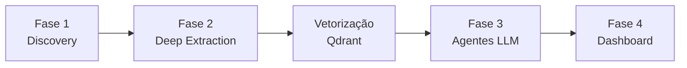
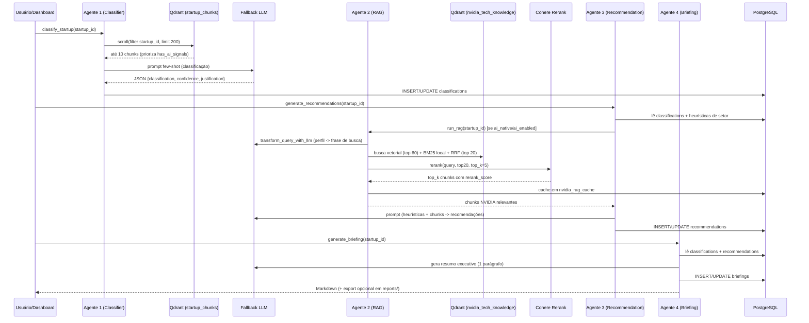

# Arquitetura

[⬅ Voltar ao README](../README.md)

## Índice

- [Visão Geral](#visão-geral)
- [Por que estas escolhas técnicas?](#por-que-estas-escolhas-técnicas)
- [Fluxo de Dados Completo](#fluxo-de-dados-completo)
- [Os 4 Agentes da Fase 3](#os-4-agentes-da-fase-3)
- [Estratégias de Resiliência](#estratégias-de-resiliência)

## Visão Geral

O projeto é organizado em 4 fases sequenciais, cada uma persistindo seu
resultado antes da próxima começar a consumi-lo. Isso permite reprocessar
qualquer fase isoladamente (ex.: reclassificar startups sem raspar os sites de
novo) e depurar cada etapa via flags `--dry-run` nos CLIs.



| Fase | Entrada | Saída | Armazenamento |
|---|---|---|---|
| 1 — Discovery | Sites de VCs/associações/rankings | Lista de startups candidatas | `startups_discovered` (Postgres) |
| 2 — Deep Extraction | `official_website` de cada startup | Chunks de conteúdo textual | `startups_content` (Postgres) |
| Vetorização | Chunks de startups + docs NVIDIA | Embeddings 384-dim | `startup_chunks` / `nvidia_tech_knowledge` (Qdrant) |
| 3 — Agentes | Chunks vetorizados + classificação | Classificação, recomendações, briefing | `classifications` / `recommendations` / `briefings` (Postgres) |
| 4 — Dashboard | Todo o exposto acima | Interface de consumo | Streamlit (sem armazenamento próprio) |

## Por que estas escolhas técnicas?

### Por que LangGraph (`@tool` do `langchain-core`) na Fase 2?

As ferramentas de descoberta de URL (`discover_startup_url`) e extração
(`extract_startup_data`) são decoradas com `@tool` do `langchain-core` **de
forma opcional e lazy** (`src/phase2/tools/url_discovery.py`,
`src/phase2/tools/extractor.py`). Isso padroniza as funções como tools
invocáveis por um agente LangGraph (`.ainvoke(...)`) sem acoplar o núcleo do
projeto à biblioteca: se `langchain-core` não estiver instalado, o código cai
para uma função assíncrona pura equivalente. O orquestrador
(`DeepScanOrchestrator._discover_url` / `_extract_with_retry`) tenta primeiro
`.ainvoke()` e usa `except AttributeError` como fallback para a chamada direta.

### Por que Qdrant?

Qdrant foi escolhido para a camada vetorial por oferecer:
- Cliente assíncrono nativo (`AsyncQdrantClient`), compatível com o resto do
  pipeline (100% `asyncio`).
- Índices de payload (`PayloadSchemaType`) sobre campos como `startup_id`,
  `has_ai_signals`, `category`, permitindo filtrar por metadados **antes** da
  busca vetorial (essencial para o Classifier Agent isolar chunks de uma única
  startup).
- Persistência local simples via bind mount (`./qdrant:/qdrant/storage`), sem
  exigir um serviço gerenciado para o escopo do projeto.

Duas coleções, ambas com vetores `COSINE` de 384 dimensões
(`sentence-transformers/all-MiniLM-L6-v2`):
- `startup_chunks` — conteúdo extraído das startups (Fase 2 → vetorização).
- `nvidia_tech_knowledge` — documentação oficial da NVIDIA (18 URLs curadas).

### Por que busca híbrida (BM25 + vetorial + RRF) em vez de só vetorial?

A busca puramente vetorial tende a perder correspondências de termos técnicos
exatos (nomes de produtos como "Triton", "NeMo", "cuDF") quando a similaridade
semântica geral não os privilegia. O RAG Agent (`src/agents/rag_agent.py`)
resolve isso em duas etapas:

1. Busca vetorial recupera os `VECTOR_TOP_K=60` chunks mais similares por
   embedding.
2. BM25 (`rank_bm25.BM25Okapi`) é recalculado **sobre esses mesmos 60 textos**
   (não sobre a coleção inteira — mantém o custo baixo) usando os termos
   literais da query.
3. **Reciprocal Rank Fusion (RRF)** combina as duas ordenações:
   `score = 1/(k + rank_vetorial) + 1/(k + rank_bm25)`, com `k=60`. Isso
   favorece chunks bem ranqueados em ambos os métodos sem exigir normalização
   de escalas de score diferentes (cosine similarity vs. BM25 score).
4. Os top 20 do RRF (`RRF_TOP=20`) seguem para o reranking com Cohere.

### Por que reranking com Cohere depois do RRF?

RRF é barato mas não entende a query, os textos e a relação entre eles com a
mesma profundidade que um cross-encoder. O Cohere Rerank v3
(`rerank-multilingual-v3.0`) reordena os 20 candidatos considerando query e
texto completo simultaneamente, produzindo o `top_k` final (padrão 5) usado
pelos Agentes 3 e 4. Como é uma chamada de rede paga e sujeita a rate-limit, o
sistema mantém um **pool de 2 chaves com failover** e um **fallback para o
ranking RRF puro** (`rerank_score=1.0` para todos) se ambas as chaves
falharem — o pipeline nunca trava por indisponibilidade do Cohere.

### Por que fallback multi-provedor de LLM em vez de um único provedor?

APIs de LLM gratuitas/de baixo custo (OpenRouter free tier, Groq) têm limites
de taxa agressivos. Para um pipeline em lote (batch de dezenas de startups),
depender de um único provedor significa falhas em cascata assim que o rate
limit é atingido. `src/agents/llm_providers.py` implementa uma cadeia de
fallback fixa:

```
OpenRouter KEY_1 → OpenRouter KEY_2 → Groq → Gemini → Ollama (local)
```

Cada etapa só entra na lista se a respectiva chave estiver configurada no
`.env` (`_build_providers()`); Ollama é sempre o último elo porque não exige
chave (roda localmente). Se todos falharem, a exceção é propagada com a
mensagem do último erro — não há silenciosamente "nenhuma resposta".

## Fluxo de Dados Completo



## Os 4 Agentes da Fase 3

### Agente 1 — Classifier (`src/agents/classifier.py`)

- **Entrada:** até 10 chunks de `startup_chunks` (Qdrant), priorizando os que
  têm `has_ai_signals=True`.
- **Prompt:** few-shot com 3 exemplos (`ai_native`, `ai_enabled`, `non_ai`),
  forçando saída em JSON puro.
- **Parsing resiliente:** `_clean_json()` remove markdown, caracteres de
  controle, tags soltas (`</</`) e fecha chaves/colchetes/aspas pendentes em
  respostas truncadas antes de tentar o parse — LLMs pequenos frequentemente
  cortam a resposta no limite de tokens.
- **Sem chunks disponíveis:** classifica como `non_ai` com confiança `0.0` por
  padrão (`_DEFAULT_NON_AI`), sem chamar o LLM.
- **Saída:** `classification`, `confidence_score` (clampado em `[0,1]`),
  `justification`, `evidence_chunks` (índices mapeados para os textos reais
  antes de persistir).

### Agente 2 — RAG Agent (`src/agents/rag_agent.py`)

- **Query Transformation:** quando chamado com `--startup-id`, converte o
  perfil da startup (nome, setor, chunks com sinal AI) em uma frase de busca
  concisa (≤30 palavras) via `generate_text_with_fallback` — não usa JSON
  mode, é texto livre.
- **Busca híbrida + RRF + Cohere:** ver seção de decisões acima.
- **Modo query direta:** `query_nvidia_rag.py --query "..."` pula a
  transformação via LLM e busca diretamente — é o modo usado pelo chat do
  dashboard (`dashboard/views/chat_rag.py`).
- **Cache:** resultados são gravados em `nvidia_rag_cache` (Postgres) quando
  chamado com `startup_id` e sem `--dry-run`.

### Agente 3 — Recommendation Agent (`src/agents/recommendation_agent.py`)

- **Camada de heurísticas determinística** (`generate_heuristic_suggestions`):
  regras de negócio explícitas por combinação classificação × setor × termos
  na justificativa (ex.: `ai_native` + `Fintech` → sugere NeMo + AI Enterprise;
  `non_ai` → sempre sugere NVIDIA Inception). Essas heurísticas são incluídas
  no prompt como "Dicas do Sistema", não substituem o LLM.
- **RAG condicional:** só busca chunks NVIDIA via Agente 2 se a classificação
  for `ai_native` ou `ai_enabled` — startups `non_ai` pulam a etapa de RAG.
- **Critério de evidência obrigatório:** o prompt exige que
  `evidence_chunks` só referencie chunks que mencionem explicitamente a
  tecnologia recomendada ou o problema que ela resolve (anti-alucinação de
  citação).
- **Fallback final:** se todos os provedores LLM falharem,
  `_heuristic_only_recommendations()` converte as sugestões de heurística em
  `Recommendation` com `provider_used="heuristics_only"` — o agente nunca
  falha silenciosamente, sempre entrega algo revisável por um humano.

### Agente 4 — Briefing Agent (`src/agents/briefing_agent.py`)

- **Abordagem híbrida:** apenas o resumo executivo (1 parágrafo, ≤100
  palavras) é gerado por LLM; todo o resto do relatório (classificação,
  evidências, recomendações agrupadas por prioridade, próximos passos) é
  renderizado por um template Python determinístico (`render_markdown`) — não
  há risco de o LLM alucinar números ou reescrever a classificação já
  persistida.
- **Fallback do resumo:** se todos os LLMs falharem,
  usa `FALLBACK_SUMMARY` genérico em vez de interromper a geração do
  relatório.
- **Exportação:** `--export-file` grava o Markdown em `reports/{id}_{nome}.md`
  além de persistir em `briefings`.

## Estratégias de Resiliência

| Camada | Mecanismo | Comportamento em falha |
|---|---|---|
| Fase 1 — QFirst | `sentence-transformers` opcional | Sem a lib: fallback lexical por palavras-chave (`QFirstScorer`) |
| Fase 1/2 — SPA | Crawl4AI opcional, timeout de 30s | Sem a lib ou timeout: parsing estático via BeautifulSoup |
| Fase 2 — URL Discovery | Tavily KEY_1 → KEY_2 → SerpAPI KEY_1 → KEY_2 | Todas falham: status `missing_url`, não derruba o batch |
| Fase 2 — Extração | JSON-LD/OpenGraph → texto (trafilatura) → SPA (Crawl4AI) | Para no primeiro nível que retorna conteúdo útil |
| Fase 2 — Rede | `tenacity` com backoff exponencial (3 tentativas) | Erros transitórios HTTP são retentados; timeout de 120s por startup evita travar o batch inteiro |
| Fase 2 — Concorrência | `SELECT ... FOR UPDATE SKIP LOCKED` | Execuções paralelas do orquestrador nunca processam a mesma linha duas vezes |
| Fase 3 — LLM | OpenRouter x2 → Groq → Gemini → Ollama local | Provedor indisponível: log WARNING + tenta o próximo; todos falham: exceção explícita (Classifier/RAG) ou heurísticas puras (Recommendation) |
| Fase 3 — Parsing de JSON do LLM | Sanitização + fechamento de JSON truncado | Resposta ainda inválida: cai para `non_ai`/confiança 0.0 com justificativa do erro |
| Fase 3 — Reranking | Cohere KEY_1 → KEY_2 | Ambas falham: usa a ordenação RRF (sem rerank_score real) |
| Persistência | UPSERT idempotente (`ON CONFLICT`) em todas as tabelas | Reprocessar uma startup nunca duplica linha; `status='high_priority'` é "pegajoso" e nunca rebaixa |
