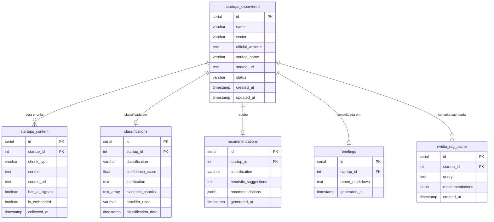

# Modelo de Dados

[⬅ Voltar ao README](../README.md)

## Índice

- [PostgreSQL — Diagrama ER](#postgresql--diagrama-er)
- [PostgreSQL — Tabelas](#postgresql--tabelas)
- [Qdrant — Coleções](#qdrant--coleções)

## PostgreSQL — Diagrama ER

## PostgreSQL — Tabelas

Migrações em `sql/`, aplicadas em ordem numérica e de forma idempotente
(`CREATE TABLE IF NOT EXISTS` / `CREATE INDEX IF NOT EXISTS`).

### `startups_discovered` (`sql/001_init.sql`) — Fase 1

Registro central de cada startup descoberta.

| Coluna | Tipo | Notas |
|---|---|---|
| `id` | `SERIAL PK` | |
| `name` | `VARCHAR(255) NOT NULL` | |
| `sector` | `VARCHAR(150)` | |
| `official_website` | `TEXT` | Normalizado por `models.normalize_url()` (scheme, lowercase, sem UTM) |
| `source_name` | `VARCHAR(100) NOT NULL` | Conector de origem (ex.: `Cubo Itaú`, `QFirst Open Search`) |
| `source_url` | `TEXT` | URL onde a startup foi encontrada (não o site oficial) |
| `status` | `VARCHAR(50)` | `pending_deep_scan` \| `high_priority` \| `deep_scan_completed` \| `deep_scan_failed` \| `missing_url` |
| `created_at` / `updated_at` | `TIMESTAMP` | |

**Índice único NULL-safe:** `(lower(trim(name)), coalesce(lower(official_website), ''))`
— garante que duas startups com mesmo nome e site nulo colidam (upsert), em
vez de duplicar, contornando o comportamento padrão do PostgreSQL onde
múltiplos `NULL` não disparam conflito de unicidade. A cláusula `ON CONFLICT`
em `src/db.py` repete exatamente essa expressão.

**Regra "pegajosa" de `status`:** o upsert nunca rebaixa uma linha já marcada
`high_priority` para outro status, mesmo que a nova extração normal a
classificaria como `pending_deep_scan`.

### `startups_content` (`sql/002_content.sql`) — Fase 2

Chunks de conteúdo extraído do site de cada startup.

| Coluna | Tipo | Notas |
|---|---|---|
| `id` | `SERIAL PK` | |
| `startup_id` | `INTEGER FK → startups_discovered(id) ON DELETE CASCADE` | |
| `chunk_type` | `VARCHAR(50) NOT NULL` | `main_text` \| `use_case` \| `tech_stack` \| `founders` \| `funding` |
| `content` | `TEXT NOT NULL` | |
| `source_url` | `TEXT NOT NULL` | |
| `has_ai_signals` | `BOOLEAN DEFAULT FALSE` | Usado para priorizar chunks no Classifier Agent |
| `is_embedded` | `BOOLEAN DEFAULT FALSE` | Coluna adicionada via migração idempotente por `phase2_vectorizer.py`; marca chunks já vetorizados no Qdrant |
| `collected_at` | `TIMESTAMP` | |

Índice parcial `ix_content_ai_signals` (`WHERE has_ai_signals = TRUE`) acelera
o ranking da Fase 3.

### `classifications` (`sql/003_classifications.sql`) — Fase 3, Agente 1

| Coluna | Tipo | Notas |
|---|---|---|
| `id` | `SERIAL PK` | |
| `startup_id` | `INTEGER FK, UNIQUE` | Um registro por startup (upsert via `ON CONFLICT (startup_id)`) |
| `classification` | `VARCHAR(20)` | `CHECK IN ('ai_native', 'ai_enabled', 'non_ai')` |
| `confidence_score` | `FLOAT NOT NULL` | Clampado em `[0.0, 1.0]` pela aplicação |
| `justification` | `TEXT NOT NULL` | Texto gerado pelo LLM |
| `evidence_chunks` | `TEXT[] NOT NULL` | Textos reais dos chunks citados como evidência (não índices) |
| `provider_used` | `VARCHAR(50) NOT NULL` | Rótulo do provedor que respondeu (ex.: `openrouter_key1`, `groq`, `ollama`, `parse_failed`) |
| `classification_date` | `TIMESTAMP` | |

### `recommendations` (`sql/005_recommendations.sql`) — Fase 3, Agente 3

| Coluna | Tipo | Notas |
|---|---|---|
| `id` | `SERIAL PK` | |
| `startup_id` | `INTEGER FK, UNIQUE` | |
| `classification` | `VARCHAR(20) NOT NULL` | Copiado de `classifications` no momento da geração |
| `heuristic_suggestions` | `TEXT` | Join das regras de negócio aplicadas (rastreabilidade) |
| `recommendations` | `JSONB NOT NULL` | Lista de objetos `Recommendation` (tech_name, category, priority, justificativas, complexity, next_actions, evidence_chunks) |
| `generated_at` | `TIMESTAMP` | |

### `briefings` (`sql/006_briefings.sql`) — Fase 3, Agente 4

| Coluna | Tipo | Notas |
|---|---|---|
| `id` | `SERIAL PK` | |
| `startup_id` | `INTEGER FK, UNIQUE` | |
| `report_markdown` | `TEXT NOT NULL` | Relatório completo já renderizado |
| `generated_at` | `TIMESTAMP` | |

### `nvidia_rag_cache` (`sql/004_rag_cache.sql`) — Fase 3, Agente 2

| Coluna | Tipo | Notas |
|---|---|---|
| `id` | `SERIAL PK` | |
| `startup_id` | `INT FK` (nullable) | `NULL` quando a busca foi por query livre (dashboard chat) |
| `query` | `TEXT NOT NULL` | Query condensada (após transformação por LLM, se aplicável) |
| `recommendations` | `JSONB NOT NULL` | Lista de `RAGChunkResult` (tech_name, category, source_url, text, rerank_score) |
| `created_at` | `TIMESTAMP` | |

`ON CONFLICT DO NOTHING` no insert — múltiplas buscas idênticas não duplicam
(não há UNIQUE explícito, então na prática permite histórico de queries).

## Qdrant — Coleções

Ambas as coleções usam vetores de **384 dimensões** com distância **COSINE**,
gerados por `sentence-transformers/all-MiniLM-L6-v2`.

### `startup_chunks`

Populada por `phase2_vectorizer.py` a partir de `startups_content`.

| Campo do payload | Tipo | Indexado | Descrição |
|---|---|---|---|
| `startup_id` | `int` | ✅ (`PayloadSchemaType.INTEGER`) | FK lógica para `startups_discovered.id` |
| `startup_name` | `str` | — | Denormalizado para exibição sem join |
| `chunk_type` | `str` | — | Mesmo domínio de `startups_content.chunk_type` |
| `has_ai_signals` | `bool` | ✅ (`PayloadSchemaType.BOOL`) | Usado para priorizar chunks no Classifier Agent |
| `source_url` | `str` | — | |
| `text` | `str` | — | Conteúdo do chunk (usado no prompt do LLM) |

**ID do ponto:** `uuid5(NAMESPACE_DNS, f"{startup_id}_{chunk_id}")` —
determinístico, então reprocessar o mesmo chunk faz upsert em vez de duplicar.

### `nvidia_tech_knowledge`

Populada por `ingest_nvidia_docs.py` a partir de 18 URLs oficiais da NVIDIA
(produtos, documentação técnica, READMEs do GitHub).

| Campo do payload | Tipo | Indexado | Descrição |
|---|---|---|---|
| `tech_name` | `str` | ✅ (`PayloadSchemaType.KEYWORD`) | Ex.: `NVIDIA Triton`, `NVIDIA RAPIDS` |
| `category` | `str` | ✅ (`PayloadSchemaType.KEYWORD`) | Ex.: `Inferência`, `Dados`, `Modelos`, `Robótica`, `Saúde` — usado no filtro `--categories` do RAG Agent |
| `source_url` | `str` | ✅ (`PayloadSchemaType.KEYWORD`) | URL de origem do chunk |
| `text` | `str` | — | Chunk de texto (gerado por `RecursiveCharacterTextSplitter`, `CHUNK_SIZE`/`CHUNK_OVERLAP` do `.env`) |
| `chunk_index` | `int` | — | Posição do chunk dentro do documento de origem |

**ID do ponto:** `uuid5(NAMESPACE_DNS, f"{tech_name}_{idx}")`.

**Estado de ingestão:** `nvidia_ingest_state.json` (raiz do projeto) rastreia
quais URLs já foram processadas e quantos chunks cada uma gerou, permitindo
retomar a ingestão sem reprocessar tudo (`--force` ignora esse estado).
