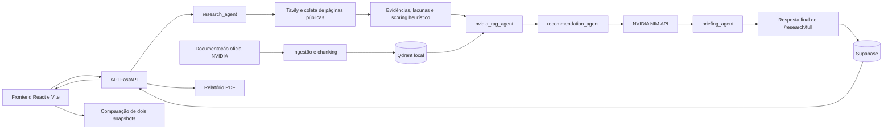

# NVIDIA Startup AI Radar

O **NVIDIA Startup AI Radar** é uma plataforma de pesquisa e análise de startups que apoia a triagem de oportunidades técnicas e comerciais relacionadas ao ecossistema NVIDIA. A aplicação pesquisa páginas públicas por meio da Tavily, coleta o conteúdo acessível, organiza evidências e lacunas, consulta uma base formada por documentação oficial NVIDIA e gera recomendações rastreáveis, briefing e plano de 90 dias.

As conclusões dependem das fontes públicas encontradas e disponíveis no momento de cada execução. A plataforma apoia análise e priorização: classificações, pontuações e recomendações não confirmam, por si só, capacidades internas ou fatos não verificados sobre uma startup.

## Sumário:

- [Objetivo do projeto](#objetivo-do-projeto)
- [Como a solução funciona](#como-a-solução-funciona)
- [Workflow LangGraph e responsabilidades](#workflow-langgraph-e-responsabilidades)
- [Onde a inteligência artificial é aplicada](#onde-a-inteligência-artificial-é-aplicada)
  - [IA na recuperação de documentação NVIDIA](#1-ia-na-recuperação-de-documentação-nvidia)
  - [IA generativa nas recomendações](#2-ia-generativa-nas-recomendações)
  - [O que não usa IA](#o-que-não-usa-ia)
- [Arquitetura da solução](#arquitetura-da-solução)
- [Tecnologias utilizadas](#tecnologias-utilizadas)
- [Estrutura do projeto](#estrutura-do-projeto)
- [Pré-requisitos](#pré-requisitos)
- [Como rodar o projeto](#como-rodar-o-projeto)
- [Variáveis de ambiente](#variáveis-de-ambiente)
- [Endpoints principais](#endpoints-principais)
- [Funcionalidades](#funcionalidades)
- [Qualidade e validação](#qualidade-e-validação)
- [Limitações do MVP](#limitações-do-mvp)
- [Possíveis evoluções](#possíveis-evoluções)
- [Observações importantes](#observações-importantes)
- [Créditos](#créditos)

## Objetivo do projeto:

O MVP implementa um fluxo para:

- pesquisar uma startup na web a partir de seu nome e, opcionalmente, setor e URL oficial;
- priorizar fontes oficiais, veículos definidos no código e páginas do ecossistema de startups;
- coletar e normalizar texto público, mantendo URL, trecho e metadados de origem;
- identificar sinais de IA, profundidade de workflow, dados proprietários, governança, escala e infraestrutura de modelos;
- calcular indicadores heurísticos de perfil de IA, risco de dependência de soluções externas e oportunidade NVIDIA;
- registrar como lacunas os temas para os quais não foram encontradas evidências públicas suficientes;
- relacionar o perfil encontrado a trechos de documentação oficial NVIDIA por meio de recuperação híbrida e reranking;
- gerar até três recomendações técnicas e comerciais com citações de fontes da startup e da NVIDIA;
- produzir briefing em Markdown e um plano de validação em três fases, de 0 a 90 dias;
- persistir snapshots completos no Supabase;
- consultar o histórico, comparar duas análises salvas no frontend e exportar relatórios em Markdown ou PDF.

## Como a solução funciona:

1. No frontend, o usuário informa o nome da startup e, opcionalmente, seu setor. A interface envia uma solicitação para `POST /research/full` com quatro fontes como limite.
2. O agente de pesquisa monta quatro consultas e usa a Tavily para descobrir fontes públicas. Redes sociais e plataformas de conteúdo listadas no código são removidas, há limite de duas páginas por domínio e as fontes restantes são priorizadas.
3. O backend acessa cada página selecionada e extrai até 15.000 caracteres com Trafilatura ou, como fallback, Beautiful Soup.
4. Regras determinísticas identificam evidências, sinais de IA e lacunas. As pontuações e a classificação (`AI-native`, `AI-enabled` ou evidência insuficiente) também são heurísticas baseadas em palavras-chave.
5. O workflow LangGraph encaminha o resultado ao RAG NVIDIA. Consultas derivadas do perfil combinam BM25, embeddings armazenados em Qdrant local, Reciprocal Rank Fusion, CrossEncoder e alinhamento por metadados.
6. A NVIDIA NIM API gera recomendações limitadas às tecnologias e evidências recuperadas. O backend valida os identificadores e as citações retornadas antes de aceitar a resposta.
7. O último nó do grafo monta um briefing em Markdown e um NVIDIA Flight Plan de 90 dias. Depois que o grafo termina, a rota `/research/full` cria o identificador da análise, monta a resposta final e persiste o snapshot e os registros relacionados no Supabase.
8. A interface permite reabrir snapshots, baixar o briefing em Markdown, solicitar um PDF ao backend e comparar duas análises da mesma startup.

## Workflow LangGraph e responsabilidades:

O fluxo completo de `POST /research/full` usa um `StateGraph` linear. Os nomes abaixo aparecem no código como agentes, mas representam **nós especializados de workflow**; isso não significa que todos sejam agentes autônomos ou usem modelos de linguagem.

| Ordem | Nó no LangGraph | Responsabilidade | Natureza da etapa |
| ----- | --------------- | ---------------- | ----------------- |
| 1 | `research_agent` | Executa descoberta, seleção e coleta das fontes; extrai evidências; valida duplicatas; monta o perfil; identifica lacunas; calcula classificação e scores | Busca externa, extração e regras determinísticas |
| 2 | `nvidia_rag_agent` | Gera consultas a partir do perfil e das lacunas e recupera trechos da base documental NVIDIA | Recuperação híbrida com busca lexical, embeddings e reranking |
| 3 | `recommendation_agent` | Envia o contexto validado à NVIDIA NIM API e valida o JSON, as tecnologias e as citações devolvidas | IA generativa com validação determinística posterior |
| 4 | `briefing_agent` | Organiza recomendações, evidências, limitações e o plano de 90 dias | Templates e regras determinísticas |

O grafo compartilha um estado tipado contendo solicitação, pesquisa, contexto NVIDIA, recomendações e briefing. Não há ramificações ou execução paralela entre os nós: a sequência é fixa. A persistência não é um quinto agente; ela é executada pela rota após `startup_radar_graph.ainvoke(...)` e remove a execução parcialmente criada se alguma gravação relacionada falhar.

## Onde a inteligência artificial é aplicada:

A IA não é usada para executar todas as etapas da plataforma. Ela aparece em dois pontos específicos: na recuperação semântica da documentação NVIDIA e na geração das recomendações. As demais etapas principais são pesquisa convencional, extração de texto, regras determinísticas ou operações de persistência e interface.

| Aplicação de IA | Modelo ou serviço | Entrada | Resultado | Implementação |
| --------------- | ----------------- | ------- | --------- | ------------- |
| Embeddings da documentação NVIDIA | `sentence-transformers/paraphrase-multilingual-MiniLM-L12-v2` | Chunks extraídos das páginas oficiais NVIDIA | Vetores usados para indexar os trechos no Qdrant local | `backend/app/rag/retriever.py` |
| Busca semântica | O mesmo modelo de embeddings | Consulta criada a partir das evidências e lacunas da startup | Trechos da documentação semanticamente próximos à necessidade encontrada | `backend/app/rag/retriever.py` e `backend/app/nvidia_context.py` |
| Reranking | `cross-encoder/mmarco-mMiniLMv2-L12-H384-v1` | Pares formados pela consulta e por cada trecho candidato | Nova pontuação de relevância para filtrar e ordenar os trechos NVIDIA | `backend/app/rag/reranker.py` |
| Geração de recomendações | Modelo configurado em `NVIDIA_LLM_MODEL`, via NVIDIA NIM API; padrão `meta/llama-3.1-8b-instruct` | Evidências públicas validadas, lacunas, classificação e trechos recuperados da documentação NVIDIA | Até três recomendações com prioridade, complexidade, razões técnica e comercial, próxima ação e citações | `backend/app/recommendation.py` |

### 1. IA na recuperação de documentação NVIDIA:

Durante a ingestão, o backend coleta as páginas NVIDIA habilitadas, divide o conteúdo em chunks e transforma cada trecho em um embedding. Esses vetores são gravados em uma coleção Qdrant local.

Quando uma startup é analisada, `nvidia_context.py` cria consultas de acordo com o perfil observado. Por exemplo, sinais de alto volume ou uma lacuna de serving podem gerar uma consulta sobre otimização de inferência. O pipeline procura os trechos mais adequados por dois caminhos:

- **busca lexical:** BM25 encontra correspondências de termos;
- **busca semântica com IA:** embeddings aproximam a consulta de trechos com significado relacionado, mesmo sem correspondência literal completa.

Os dois rankings são combinados por Reciprocal Rank Fusion. Depois, o CrossEncoder avalia diretamente cada par consulta–trecho e o código aplica filtros adicionais de alinhamento e diversidade. O resultado não é um texto inventado pelo modelo: é uma seleção de trechos existentes nas fontes oficiais, acompanhados de URL e pontuações.

### 2. IA generativa nas recomendações:

Depois da pesquisa pública e do RAG, `recommendation.py` envia à NVIDIA NIM API um contexto estruturado contendo:

- evidências públicas encontradas sobre a startup;
- classificação e lacunas calculadas pelo backend;
- tecnologias e trechos recuperados da documentação NVIDIA;
- identificadores permitidos para tecnologias e evidências.

O modelo deve retornar JSON com no máximo três recomendações. Cada recomendação inclui prioridade, complexidade, justificativa técnica, justificativa de negócio, próxima ação e citações. Após a resposta da LLM, o backend valida o JSON e confere se as tecnologias e evidências citadas realmente estavam no contexto enviado. Recomendações sem tecnologia ou evidências válidas são rejeitadas.

### O que não usa IA:

- A Tavily é usada como serviço de busca, mas o projeto não usa a resposta dela para gerar as conclusões; aproveita os resultados para descobrir URLs públicas.
- A coleta e a extração de páginas são realizadas por HTTPX, Trafilatura e Beautiful Soup.
- A identificação de evidências e sinais usa listas de palavras-chave e expressões definidas em `evidence.py`.
- Os três scores e a classificação usam regras fixas de pontuação em `scoring.py`.
- As lacunas são criadas pela ausência de evidências em categorias predeterminadas.
- O briefing em Markdown e o plano de 90 dias são montados por templates e regras em `briefing.py`.
- A comparação entre snapshots usa cálculos TypeScript no frontend; não solicita interpretação a um modelo.
- O LangGraph coordena a ordem das etapas, mas não é, por si só, um modelo de IA.

## Arquitetura da solução:



### Componentes:

- **Frontend:** aplicação React de página única. Cria análises, exibe histórico, indicadores, lacunas, recomendações, plano de 90 dias, contexto NVIDIA, evidências e briefing.
- **API:** FastAPI expõe os fluxos parciais e completos, histórico, verificação do banco e relatório PDF. O CORS local aceita `http://localhost:5173` e `http://127.0.0.1:5173`.
- **Pesquisa pública:** Tavily descobre páginas; HTTPX as acessa; Trafilatura e Beautiful Soup extraem o conteúdo.
- **Análise baseada em regras:** categorias de evidência, sinais, lacunas e scores são calculados no backend sem uma etapa de LLM.
- **Base NVIDIA:** o catálogo versionado em `nvidia_sources.json` define as páginas habilitadas. A ingestão coleta essas páginas, cria chunks e grava os artefatos em diretórios locais ignorados pelo Git.
- **RAG:** combina busca lexical BM25 e busca semântica em Qdrant embutido, faz fusão de rankings e aplica um CrossEncoder.
- **Recomendações:** a API de chat NVIDIA recebe apenas o contexto estruturado e deve retornar JSON; a aplicação valida tecnologias e evidências contra os catálogos enviados.
- **Persistência:** Supabase armazena startups, execuções, fontes, evidências, contexto NVIDIA, recomendações, citações, briefings e o snapshot JSON completo.
- **Relatórios:** o Markdown é gerado no briefing e baixado pelo navegador; o PDF é montado pelo backend a partir de uma análise salva.
- **Comparação:** não há endpoint específico. O frontend carrega dois snapshots pelo endpoint de detalhe, ordena-os pela data do briefing e compara scores, evidências, lacunas e recomendações.

## Tecnologias utilizadas:

| Tecnologia | Uso no projeto |
| ---------- | -------------- |
| Python | Implementação do backend e dos pipelines de análise |
| FastAPI, Uvicorn e Pydantic | API HTTP, servidor ASGI, validação e contratos de dados |
| LangGraph | Orquestração sequencial dos agentes de pesquisa, RAG, recomendação e briefing |
| Tavily | Descoberta de fontes públicas |
| HTTPX, Trafilatura e Beautiful Soup | Acesso às páginas e extração de texto |
| Sentence Transformers | Embeddings multilíngues e CrossEncoder de reranking |
| BM25 e Reciprocal Rank Fusion | Recuperação lexical e combinação dos rankings lexical e semântico |
| Qdrant Client | Banco vetorial local, persistido em `backend/knowledge_base/qdrant/` |
| NVIDIA NIM API | Geração das recomendações estruturadas por modelo de linguagem |
| Supabase/PostgreSQL | Persistência dos snapshots e dados relacionados |
| ReportLab | Geração dos relatórios PDF no backend |
| React 19 e TypeScript | Interface web e tipagem do frontend |
| Vite 8 | Servidor de desenvolvimento e build do frontend |
| React Markdown e remark-gfm | Renderização do briefing Markdown na interface |
| ESLint | Análise estática do frontend |

As versões exatas das dependências Python estão em `backend/requirements.txt`; as dependências JavaScript e o lockfile estão em `frontend/package.json` e `frontend/package-lock.json`.

## Estrutura do projeto:

```text
nvidia-startup-ai-radar/
├── backend/
│   ├── app/
│   │   ├── main.py                 # API FastAPI e rotas
│   │   ├── workflow.py             # Grafo LangGraph do fluxo completo
│   │   ├── discovery.py            # Busca e priorização de fontes
│   │   ├── collector.py            # Coleta e extração de páginas
│   │   ├── research.py             # Pipeline de pesquisa pública
│   │   ├── evidence.py             # Evidências, validação, perfil e lacunas
│   │   ├── scoring.py              # Scores e classificação heurística
│   │   ├── nvidia_context.py       # Consultas e contexto NVIDIA
│   │   ├── recommendation.py       # Chamada à NVIDIA NIM API e validação
│   │   ├── briefing.py             # Briefing Markdown e plano de 90 dias
│   │   ├── database.py             # Cliente e health check do Supabase
│   │   ├── persistence.py          # Gravação da análise completa
│   │   ├── history.py              # Consultas de histórico e snapshots
│   │   ├── pdf_report.py           # Montagem do relatório PDF
│   │   ├── schemas.py              # Contratos da pesquisa pública
│   │   └── rag/
│   │       ├── ingest.py           # Coleta, chunking e indexação NVIDIA
│   │       ├── retriever.py        # BM25, embeddings, Qdrant e RRF
│   │       ├── reranker.py         # CrossEncoder e filtros de relevância
│   │       ├── service.py          # Serviço de consulta RAG
│   │       └── schemas.py          # Contratos de RAG, recomendações e histórico
│   ├── database/
│   │   └── 001_initial_schema.sql  # Schema, índices, RLS e permissões
│   ├── knowledge_base/
│   │   └── nvidia_sources.json     # Catálogo de fontes oficiais NVIDIA
│   ├── .env.example                # Modelo das variáveis do backend
│   └── requirements.txt            # Dependências Python fixadas
├── frontend/
│   ├── public/                     # Ícones públicos
│   ├── src/
│   │   ├── App.tsx                 # Fluxos e telas da aplicação
│   │   ├── App.css                 # Estilos da interface
│   │   ├── api.ts                  # Cliente HTTP e tipos compartilhados
│   │   └── main.tsx                # Entrada do React
│   ├── .env.example                # URL local da API para o Vite
│   ├── eslint.config.js            # Configuração do ESLint
│   ├── package.json                # Scripts e dependências do frontend
│   ├── package-lock.json           # Lockfile npm
│   └── vite.config.ts              # Configuração do Vite
├── .gitignore
└── README.md
```

Os diretórios `backend/knowledge_base/raw/`, `processed/` e `qdrant/` são gerados pela ingestão e não são versionados.

## Pré-requisitos:

- Git.
- Python 3 e `pip`. O repositório não declara uma versão mínima de Python; use uma versão compatível com os pins de `backend/requirements.txt`.
- Node.js `^20.19.0` ou `>=22.12.0`, conforme o requisito do Vite registrado no lockfile, e npm.
- Projeto Supabase com acesso ao editor SQL e uma chave de servidor (`secret` ou `service_role`).
- Chave da Tavily para pesquisa pública.
- Chave da NVIDIA API compatível com o endpoint de chat usado pelo backend.
- Acesso à internet para Tavily, NVIDIA, Supabase, páginas pesquisadas, documentação NVIDIA e download inicial dos modelos do Hugging Face.
- Espaço local para os modelos de embeddings/reranking e para o índice Qdrant.

O Qdrant roda em modo local por meio do cliente Python; não é necessário iniciar um servidor Qdrant separado.

O procedimento deste README está orientado a Windows, com PowerShell ou Git Bash. O manifesto Python inclui `pywin32==312`; a instalação integral em Linux ou macOS não está configurada nem validada no repositório atual.

## Como rodar o projeto:

### 1. Clonar o repositório:

```bash
git clone https://github.com/f4bianne/nvidia-startup-ai-radar.git
cd nvidia-startup-ai-radar
```

### 2. Configurar o Supabase:

1. Crie ou selecione um projeto no Supabase.
2. Abra o editor SQL do projeto.
3. Execute integralmente `backend/database/001_initial_schema.sql`.
4. Guarde a URL do projeto e uma chave `secret` ou `service_role` para o arquivo de ambiente do backend.

O script cria nove tabelas, índices, relacionamentos e políticas de segurança. O acesso anônimo e autenticado às tabelas é revogado; por isso, o backend precisa usar uma chave de servidor e essa chave nunca deve ser exposta no frontend.

### 3. Configurar o backend:

Entre no diretório do backend:

```bash
cd backend
```

Crie o ambiente virtual.

**PowerShell:**

```powershell
python -m venv .venv
.\.venv\Scripts\Activate.ps1
```

**Git Bash:**

```bash
python -m venv .venv
source .venv/Scripts/activate
```

Instale as dependências declaradas:

```bash
python -m pip install --upgrade pip
python -m pip install -r requirements.txt
```

Copie o arquivo de exemplo para `backend/.env`:

```bash
cp .env.example .env
```

No PowerShell, use:

```powershell
Copy-Item .env.example .env
```

Preencha os valores no arquivo copiado. Como alternativa a `SUPABASE_SECRET_KEY`, o backend aceita `SUPABASE_SERVICE_ROLE_KEY`. Não é necessário configurar as duas; a chave `secret` tem precedência no código.

Inicie a API a partir de `backend/`:

```bash
python -m uvicorn app.main:app --reload
```

Por padrão, o Uvicorn atende em `http://127.0.0.1:8000`.

### 4. Preparar a base documental NVIDIA:

Antes do primeiro fluxo que consulta contexto NVIDIA, execute a ingestão. Ela baixa as páginas habilitadas em `knowledge_base/nvidia_sources.json`, cria os chunks, carrega o modelo de embeddings e monta o índice Qdrant local.

**PowerShell:**

```powershell
Invoke-RestMethod -Method Post -Uri http://127.0.0.1:8000/nvidia-rag/ingest
```

**Git Bash:**

```bash
curl -X POST http://127.0.0.1:8000/nvidia-rag/ingest
```

A primeira ingestão e a primeira consulta podem demorar mais por causa do download dos modelos `sentence-transformers/paraphrase-multilingual-MiniLM-L12-v2` e `cross-encoder/mmarco-mMiniLMv2-L12-H384-v1`.

### 5. Configurar o frontend:

Em outro terminal, a partir da raiz do repositório:

```bash
cd frontend
npm ci
```

Copie o arquivo de exemplo para `frontend/.env`:

```bash
cp .env.example .env
```

No PowerShell, use:

```powershell
Copy-Item .env.example .env
```

Inicie o servidor de desenvolvimento:

```bash
npm run dev
```

O Vite atende normalmente em `http://localhost:5173`. Essa origem e a variante `127.0.0.1:5173` já estão liberadas no CORS do backend.

### 6. Acessar e usar a aplicação:

- Interface: `http://localhost:5173`
- API: `http://127.0.0.1:8000`
- Swagger UI: `http://127.0.0.1:8000/docs`
- ReDoc: `http://127.0.0.1:8000/redoc`
- OpenAPI JSON: `http://127.0.0.1:8000/openapi.json`

Na interface:

1. Clique em **Nova análise**.
2. Informe o nome da startup e, se desejar, o setor.
3. Clique em **Iniciar análise**. O frontend sempre solicita até quatro fontes nesse fluxo.
4. Consulte as abas de resumo, recomendações, plano de 90 dias, contexto NVIDIA, evidências e briefing.
5. Use os botões da análise para baixar Markdown ou PDF.
6. Clique em uma startup do histórico para abrir seus snapshots. Com ao menos dois snapshots, escolha **Comparar análises**, selecione duas versões e confirme a comparação.

## Variáveis de ambiente:

### Backend — `backend/.env`:

| Variável | Obrigatória? | Finalidade | Exemplo seguro |
| -------- | ------------ | ---------- | -------------- |
| `TAVILY_API_KEY` | Sim para descoberta e pesquisa | Autentica as buscas públicas na Tavily | `tvly-...` |
| `NVIDIA_API_KEY` | Sim para recomendações e fluxo completo | Autentica a chamada de chat na NVIDIA NIM API | `nvapi-...` |
| `NVIDIA_LLM_MODEL` | Não | Sobrescreve o modelo de recomendação; o padrão é `meta/llama-3.1-8b-instruct` | `meta/llama-3.1-8b-instruct` |
| `SUPABASE_URL` | Sim para persistência e histórico | URL pública do projeto Supabase usada pelo cliente do backend | `https://seu-projeto.supabase.co` |
| `SUPABASE_SECRET_KEY` | Sim para persistência e histórico, salvo se a variável abaixo for usada | Chave de servidor preferida pelo código | `sb_secret_...` |
| `SUPABASE_SERVICE_ROLE_KEY` | Alternativa | Chave `service_role` aceita quando `SUPABASE_SECRET_KEY` não foi definida | `eyJ...` |

### Frontend — `frontend/.env`:

| Variável | Obrigatória? | Finalidade | Exemplo seguro |
| -------- | ------------ | ---------- | -------------- |
| `VITE_API_URL` | Sim | URL-base da API; a aplicação lança erro na inicialização se estiver ausente | `http://127.0.0.1:8000` |

Os arquivos `backend/.env.example` e `frontend/.env.example` documentam a configuração esperada sem conter credenciais. Os arquivos `.env`, suas variantes locais e formatos comuns de credenciais são ignorados pelo Git. Nunca coloque a chave de servidor do Supabase, a chave Tavily ou a chave NVIDIA em variáveis `VITE_*`, pois elas são incorporadas ao bundle do navegador.

## Endpoints principais:

| Método | Rota | Finalidade |
| ------ | ---- | ---------- |
| `GET` | `/` | Metadados básicos da API e lista informativa de rotas |
| `GET` | `/health` | Verificação simples de disponibilidade da API |
| `GET` | `/database/health` | Teste de conexão e leitura da tabela `startups` no Supabase |
| `POST` | `/discover-sources` | Descoberta e priorização de fontes públicas |
| `POST` | `/collect` | Coleta e extração de uma URL fornecida |
| `POST` | `/analyze` | Análise heurística de uma única URL |
| `POST` | `/analyze-multiple` | Análise heurística de até seis URLs fornecidas |
| `POST` | `/research` | Pipeline de descoberta, seleção, coleta, evidências, lacunas e scores |
| `POST` | `/nvidia-rag/ingest` | Ingestão das fontes NVIDIA habilitadas e criação do índice local |
| `POST` | `/nvidia-rag` | Consulta direta ao RAG NVIDIA |
| `POST` | `/research/nvidia-context` | Pesquisa pública acrescida de contexto NVIDIA |
| `POST` | `/research/recommendations` | Pesquisa, contexto NVIDIA e recomendações |
| `POST` | `/research/briefing` | Pesquisa, contexto, recomendações, briefing e plano de 90 dias, sem persistência |
| `POST` | `/research/full` | Workflow completo com persistência no Supabase |
| `GET` | `/startups?limit=20` | Lista startups salvas; `limit` aceita valores de 1 a 100 |
| `GET` | `/startups/{startup_id}/analyses` | Lista os snapshots de uma startup |
| `GET` | `/analyses/{analysis_id}` | Recupera o snapshot completo de uma análise |
| `GET` | `/analyses/{analysis_id}/briefing` | Recupera o briefing Markdown salvo |
| `GET` | `/analyses/{analysis_id}/report.pdf` | Gera e baixa o PDF de uma análise salva |

Os contratos completos e exemplos gerados pelo FastAPI estão disponíveis em `/docs`. Não existe autenticação própria nas rotas da API.

## Funcionalidades:

### 1. Pesquisa e análise de startup:

O pipeline cria consultas por nome, setor, IA, produto, captação e site oficial. A API aceita opcionalmente `official_url`, embora o formulário atual do frontend envie apenas nome e setor. As fontes são classificadas por tipo e prioridade, deduplicadas e limitadas por domínio antes da coleta.

### 2. Evidências públicas e rastreabilidade:

As evidências contêm afirmação, trecho de até 500 caracteres, URL, categoria, status e confiança. A validação remove duplicatas e rejeita itens sem afirmação, com trecho curto, URL pública inválida ou status fora do contrato. No pipeline atual, as evidências encontradas por regras recebem status `OBSERVADA` e confiança `0.95`.

### 3. Pontos que precisam de validação:

Quando não existem evidências nas categorias de dados proprietários, governança e segurança, serving de modelos ou profundidade de workflow, a análise cria lacunas com status `DESCONHECIDA`. Isso significa ausência de evidência pública suficiente no material coletado, não ausência comprovada da capacidade.

### 4. Classificação e indicadores heurísticos:

O backend calcula `ai_native_score`, `wrapper_risk_score` e `nvidia_opportunity_score` a partir de palavras-chave e sinais encontrados. A categoria final distingue IA central ao produto, IA como apoio ou evidência insuficiente. Os scores servem para organizar a análise; não são medições estatísticas validadas.

### 5. Consulta à documentação oficial NVIDIA:

O catálogo possui fontes habilitadas para NVIDIA Inception, NIM, Triton Inference Server, TensorRT-LLM, NeMo Guardrails, NeMo Retriever, RAPIDS cuDF e NVIDIA AI Enterprise. Outras fontes permanecem cadastradas, porém desabilitadas. Somente itens habilitados participam da ingestão.

### 6. Recomendações técnicas e de negócio:

A NVIDIA NIM API pode produzir até três recomendações, cada uma com prioridade, complexidade, justificativas técnica e comercial, próxima ação e citações separadas entre startup e documentação NVIDIA. O backend descarta tecnologias e IDs de evidência que não existam no contexto fornecido.

### 7. Plano de 90 dias:

> **Diferencial:** cada análise completa transforma as recomendações em um roteiro de validação técnica e comercial para os 90 dias seguintes.

O briefing inclui um plano determinístico em três fases: diagnóstico e desenho do piloto (0–30 dias), implementação e validação técnica (31–60 dias) e avaliação, escala e próximo ciclo (61–90 dias). Cada fase apresenta objetivo, ações, tecnologias NVIDIA e critérios de sucesso. As tecnologias são preenchidas a partir das recomendações aceitas.

O plano é montado por regras e templates em `backend/app/briefing.py`; não é gerado livremente pela LLM e deve ser ajustado após validação com a startup.

### 8. Histórico de análises:

O fluxo completo salva o JSON integral e também normaliza fontes, evidências, contexto NVIDIA, recomendações, citações e briefing em tabelas relacionadas. O histórico lista startups e snapshots em ordem decrescente de criação.

### 9. Comparação visual entre snapshots:

> **Diferencial:** o histórico permite comparar análises realizadas em períodos distintos e transformar mudanças nas evidências públicas em pontos de atenção e próximas conversas.

O botão de comparação aparece no histórico quando uma startup possui pelo menos dois snapshots. O usuário seleciona exatamente duas análises dessa mesma startup; o frontend carrega ambas por `GET /analyses/{analysis_id}`, ordena-as pela data de geração do briefing e calcula a comparação no navegador. Nenhum novo snapshot é criado e não existe endpoint específico de comparação.

A tela destaca uma mudança principal segundo esta ordem definida no frontend:

1. nova categoria de lacuna que precisa ser validada;
2. nova tecnologia recomendada;
3. redução na quantidade de evidências públicas;
4. aumento na quantidade de evidências públicas;
5. leitura geral estável, quando nenhuma condição anterior ocorre.

O destaque é acompanhado pelos blocos **Por que isso importa**, **O que continua válido** e **Próxima conversa sugerida**. Em uma área expansível, a visualização lado a lado mostra:

- perfil identificado;
- papel da IA no produto;
- dependência de soluções externas;
- potencial de colaboração com NVIDIA;
- quantidade de evidências e fontes coletadas com sucesso;
- pontos que precisam ser confirmados;
- tecnologias sugeridas em cada snapshot;
- links para abrir as duas análises completas.

Os três scores são apresentados nessa tela por faixas descritivas, e não como uma nova avaliação produzida durante a comparação. O destaque e os textos de continuidade/próxima conversa são construídos por regras TypeScript em `frontend/src/App.tsx`.

Mudanças isoladas nos scores aparecem na visualização lado a lado, mas não participam da regra que escolhe o destaque principal.

Diferenças podem resultar de fontes novas, páginas indisponíveis, variação da busca/coleta ou mudanças reais na startup. Portanto, a comparação não deve ser usada isoladamente como prova de evolução ou piora.

### 10. Relatórios em Markdown e PDF:

O navegador baixa o briefing salvo como `.md`. Para o PDF, o frontend solicita `GET /analyses/{analysis_id}/report.pdf`; o backend reconstrói um documento A4 com resumo, indicadores, lacunas, recomendações, evidências e plano de 90 dias.

### 11. Documentação da API:

O FastAPI gera Swagger UI, ReDoc e o schema OpenAPI automaticamente. Os fluxos parciais permitem inspecionar descoberta, coleta, pesquisa, RAG e recomendação separadamente.

## Qualidade e validação:

### Frontend:

Análise estática:

```bash
cd frontend
npm run lint
```

Verificação TypeScript e build de produção:

```bash
cd frontend
npm run build
```

Pré-visualização do build já gerado:

```bash
cd frontend
npm run preview
```

Esse comando serve o bundle para inspeção local. Na porta padrão do preview (`4173`), as chamadas à API ficam bloqueadas pelo CORS atual do backend, que libera apenas a porta `5173`.

### Backend:

Não há suíte de testes, configuração de lint, formatação ou checagem de tipos versionada para o backend. Depois de instalar `requirements.txt`, é possível verificar a consistência das dependências e a importação da aplicação sem iniciar serviços externos:

```bash
cd backend
python -m pip check
python -c "import app.main; print('Backend importado com sucesso')"
```

A verificação operacional disponível é iniciar a API, consultar o health check simples e, com o Supabase configurado, testar a conexão:

```bash
curl http://127.0.0.1:8000/health
curl http://127.0.0.1:8000/database/health
```

No PowerShell, os equivalentes são:

```powershell
Invoke-RestMethod http://127.0.0.1:8000/health
Invoke-RestMethod http://127.0.0.1:8000/database/health
```

## Limitações do MVP:

- A análise depende da cobertura da Tavily e de páginas públicas acessíveis no momento da execução. Conteúdo protegido por login, bloqueios, JavaScript ou restrições de acesso pode não ser coletado.
- A coleta é sequencial, usa timeout de 20 segundos por página, limita o texto extraído a 15.000 caracteres e analisa entre três e seis fontes na API; o frontend solicita quatro.
- Redes sociais e plataformas listadas no backend são excluídas do pipeline de pesquisa, o que reduz a cobertura de sinais publicados apenas nesses canais.
- Evidências, classificação e scores usam regras e palavras-chave fixas. Os números não representam precisão, probabilidade ou avaliação independente da startup.
- Ausência de evidência pública não significa ausência de uma capacidade interna. As lacunas devem orientar validação direta com a startup.
- Recomendações dependem do conteúdo recuperado, da resposta do modelo NVIDIA configurado e de validações estruturais. Elas não substituem discovery técnico, validação de arquitetura, segurança, custos ou viabilidade comercial.
- O índice NVIDIA é local e precisa ser ingerido antes das consultas. Os diretórios gerados não são versionados, e a atualização só ocorre quando a ingestão é executada novamente.
- A ingestão recria toda a coleção Qdrant; não há atualização incremental nem agendamento automático.
- A comparação é calculada no navegador e confronta somente dois snapshots salvos. Mudanças podem refletir variação das fontes, não uma mudança real da startup.
- O fluxo completo exige Tavily, NVIDIA API, base RAG ingerida e Supabase. Falha na persistência faz `POST /research/full` retornar erro, mesmo após as etapas analíticas terem sido executadas.
- A API não implementa autenticação, autorização por usuário, rate limiting ou isolamento multi-tenant.
- A configuração CORS está fixa para o Vite local na porta 5173.
- O manifesto Python inclui `pywin32`; o procedimento de instalação atual é voltado a Windows e não documenta uma configuração equivalente validada para Linux ou macOS.
- Não há testes automatizados versionados para backend ou frontend.

## Possíveis evoluções:

As três ideias de evoluções abaixo não fazem parte da versão atual do MVP, elas representam possibilidades de produto para transformar a análise pontual de startups em um fluxo mais contínuo, colaborativo e útil para priorização técnica e comercial.

| Evolução | O que seria entregue | Valor gerado |
| --- | --- | --- |
| Monitoramento contínuo de startups | Reexecução periódica de análises salvas, histórico cronológico e alertas quando novas fontes, evidências, lacunas ou tecnologias recomendadas forem identificadas. | Permite acompanhar mudanças relevantes sem precisar iniciar manualmente uma nova análise a cada vez. |
| Linha do tempo de mudanças | Uma visualização cronológica mostrando quando uma evidência apareceu, deixou de aparecer ou mudou de categoria, separando claramente informação pública, hipótese e validação direta. | Torna a comparação entre snapshots mais confiável e fácil de interpretar ao longo do tempo. |
| Comparação com startups semelhantes | Seleção de startups de um mesmo setor ou problema de negócio para comparar evidências públicas, lacunas, tecnologias sugeridas e estágio de maturidade de IA. | Ajuda a contextualizar cada oportunidade sem tratar scores isolados como decisão final. |

## Observações importantes:

O repositório implementa um MVP de caráter experimental e demonstrativo. Ele trabalha com informações públicas e produz hipóteses, indicadores heurísticos e recomendações que precisam ser validados antes de decisões técnicas ou comerciais.

O projeto não confirma informações internas das startups, não substitui diligência técnica ou comercial e não constitui recomendação de investimento.

## Créditos:

- Desenvolvimento: Fabianne Jesus.
- Projeto: NVIDIA Startup AI Radar.
