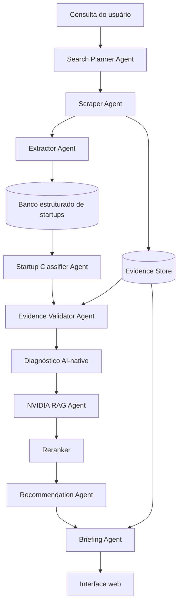

# **Projeto: Seraphim Scout**

## 1\. Contextualização do problema

O mercado de inteligência artificial está passando por uma mudança estrutural. Grandes laboratórios como OpenAI, Anthropic, Google DeepMind, Meta e outros deixaram de atuar apenas como fornecedores de modelos fundacionais e passaram a subir na cadeia de valor. Hoje, esses laboratórios oferecem APIs multimodais, agentes, ferramentas de produtividade, busca, voz, código, automação de workflows, memória, integrações corporativas e produtos finais para empresas.

Esse movimento cria uma ameaça direta para startups de IA, principalmente para aquelas que se posicionam apenas como wrappers de LLMs. Uma startup que apenas conecta uma API da OpenAI, Anthropic ou outro provedor a uma interface gráfica, sem dados proprietários, sem workflow profundo, sem distribuição clara e sem otimização técnica, pode ser rapidamente substituída por funcionalidades nativas dos grandes labs.

Ao mesmo tempo, surge uma oportunidade importante: startups podem se diferenciar ao se tornarem AI-native services. Nesse modelo, a empresa combina software, agentes de IA, dados proprietários, automação e serviço especializado para entregar resultados de negócio de ponta a ponta. Em vez de vender apenas uma ferramenta SaaS, a empresa passa a vender um resultado operacional aumentado por IA.

Nesse contexto, a NVIDIA tem uma posição estratégica. Muitas startups usam IA, mas poucas otimizam toda a stack técnica. Em geral, founders começam usando APIs externas pela simplicidade, mas conforme crescem passam a enfrentar problemas de custo, latência, escalabilidade, governança, privacidade, avaliação, observabilidade e dependência de fornecedores. A stack da NVIDIA pode ajudar essas empresas a evoluir de protótipos baseados em APIs para sistemas de IA escaláveis, eficientes e preparados para produção.

Este projeto propõe a construção de uma plataforma multi-agente capaz de mapear startups brasileiras com potencial AI-native, coletar informações públicas sobre elas, diagnosticar sua maturidade técnica e recomendar tecnologias da NVIDIA adequadas ao perfil de cada empresa. A solução deve funcionar como uma ferramenta de inteligência para apoiar o gerente de Startups & VCs da NVIDIA no Brasil a atrair, qualificar e nutrir startups para o programa NVIDIA Inception.

## 2\. Objetivo do projeto

Construir um sistema capaz de:

\- Encontrar startups brasileiras com sinais de uso intensivo de IA.  
\- Coletar dados públicos sobre empresa, produto, setor, clientes, funding, founders e tecnologias utilizadas.  
\- Avaliar possíveis gaps na stack de IA da empresa.  
\- Consultar uma base de conhecimento sobre tecnologias NVIDIA.  
\- Recomendar as tecnologias NVIDIA mais adequadas para a startup encontrada.  
\- Gerar um briefing executivo para apoiar abordagem comercial, técnica e comunitária pelo NVIDIA Inception.

## 3\. Pergunta norteadora

Como a NVIDIA pode identificar, atrair e nutrir startups brasileiras AI-native em um contexto no qual os grandes labs de IA estão ameaçando startups que dependem apenas de wrappers de LLM?

## 4\. Escopo da solução

O sistema deve possuir uma pipeline multi-agente que deve buscar empresas relevantes, coletar informações públicas, estruturar os dados encontrados, classificar a maturidade AI-native da empresa e consultar uma base RAG com tecnologias NVIDIA para gerar recomendações personalizadas.

O frontend fica livre para os alunos escolherem. O foco principal do projeto está na arquitetura de IA, nos agentes, na pipeline de dados, no RAG com reranking e na qualidade das recomendações.

### 4.1 MVP obrigatório

Para reduzir risco de execução, o projeto deve primeiro entregar um MVP funcional antes de avançar para diferenciais. O MVP deve permitir que um usuário pesquise uma startup ou segmento, execute a pipeline de coleta e receba um briefing com evidências e recomendações NVIDIA.

O MVP obrigatório inclui:

\- Uma consulta inicial por nome de startup, setor ou tese de busca.  
\- Coleta de informações públicas em pelo menos 3 fontes por startup analisada, quando disponíveis.  
\- Extração estruturada de nome, site, descrição, setor, sinais de uso de IA, fontes e trechos de evidência.  
\- Classificação da startup como AI-native, AI-enabled ou non-AI com justificativa baseada em evidências.  
\- Base RAG com pelo menos 8 tecnologias NVIDIA relevantes para startups de IA.  
\- Recomendação de até 5 tecnologias NVIDIA por startup, com prioridade, complexidade e próxima ação sugerida.  
\- Briefing final exportável ou copiável contendo diagnóstico, evidências, recomendações e links de origem.  
\- Interface mínima para iniciar consulta, acompanhar resultado e visualizar o briefing.

Ficam como diferenciais após o MVP: crawling em larga escala, monitoramento contínuo de startups, ranking de leads, integração com CRM, geração automática de e-mails de abordagem, avaliação avançada de custo/latência e dashboards analíticos.

### 4.2 Matriz de maturidade AI-native

A classificação de maturidade deve ser baseada em evidências observáveis, não apenas em linguagem de marketing da startup. A matriz abaixo serve como referência para o Startup Classifier Agent e para revisão humana.

| Categoria | Definição | Sinais fortes | Sinais fracos ou alerta | Exemplo de interpretação |
| --- | --- | --- | --- | --- |
| AI-native | A IA é parte central do produto, da entrega de valor ou da operação do serviço. Sem IA, a proposta principal perde força. | Produto baseado em agentes, modelos próprios ou pipelines de IA; dados proprietários; automação de workflow; avaliação ou monitoramento de modelos; equipe técnica de IA. | Discurso genérico sobre IA sem evidência técnica; dependência exclusiva de prompts simples; ausência de dados ou workflow específico. | Plataforma que automatiza análise jurídica, atendimento clínico, suporte técnico ou operação financeira usando IA como motor principal. |
| AI-enabled | A IA melhora um produto existente, mas não é o núcleo do negócio. A empresa ainda entrega valor mesmo sem IA. | Features com IA em um SaaS tradicional; copilots; classificação, recomendação ou sumarização em fluxos já existentes. | IA aparece apenas como feature recente; pouca evidência de impacto operacional; diferenciação baixa frente a incumbentes. | CRM, ERP, plataforma de RH ou ferramenta de BI que adiciona assistentes, insights ou automações com IA. |
| Non-AI | Não há evidências suficientes de uso real de IA no produto ou operação. | Produto descrito sem IA; ausência de sinais técnicos; nenhuma menção consistente a modelos, automação inteligente ou dados. | Uso de termos como "inteligente" ou "automático" sem comprovação; conteúdo comercial ambíguo. | Marketplace, fintech, edtech ou SaaS operacional sem sinais claros de IA aplicada. |
| Unknown | Há indícios, mas as fontes públicas não sustentam uma classificação confiável. | Poucas fontes, site fora do ar, informações antigas ou contraditórias. | Classificação baseada em uma única fonte ou em inferência sem trecho de evidência. | Startup citada em notícia como "usa IA", mas sem produto, caso de uso ou detalhe técnico verificável. |

Critérios de confiança:

\- Alta confiança: pelo menos 3 fontes independentes ou oficiais sustentam a classificação, com trechos claros de evidência.  
\- Média confiança: 2 fontes sustentam a classificação, mas ainda há lacunas sobre stack, clientes ou profundidade técnica.  
\- Baixa confiança: apenas 1 fonte, evidência vaga ou inferência baseada em linguagem comercial.

## 5\. Tecnologias principais

### 5.1 LangGraph

LangGraph será utilizado para criar o sistema multi-agente. Diferentemente de uma cadeia simples de prompts, o LangGraph permite modelar um fluxo de trabalho com estado, nós, transições condicionais, checkpoints, retry, intervenção humana e controle mais robusto sobre o comportamento dos agentes.

**Agentes sugeridos:**

\- Search Planner Agent: transforma a consulta do usuário em termos de busca e fontes prioritárias.  
\- Scraper Agent: coleta informações públicas de sites, notícias, diretórios e páginas institucionais.  
\- Extractor Agent: transforma conteúdo não estruturado em dados estruturados.  
\- Startup Classifier Agent: classifica a empresa como AI-native, AI-enabled ou non-AI.  
\- Evidence Validator Agent: valida se as afirmações possuem fontes suficientes.  
\- NVIDIA RAG Agent: consulta a base de conhecimento de tecnologias NVIDIA.  
\- Recommendation Agent: cruza o perfil da startup com as tecnologias NVIDIA.  
\- Briefing Agent: gera o relatório final para o gerente de Startups & VCs.

### 5.2 Scraping e coleta de informações

A etapa de scraping será responsável por buscar informações públicas sobre empresas. O objetivo não é copiar bases fechadas ou violar termos de uso, mas coletar informações disponíveis publicamente com rastreabilidade das fontes.

Tecnologias recomendadas:

\- **Playwright**: scraping de sites dinâmicos que dependem de JavaScript.  
\- **BeautifulSoup**: parsing de páginas HTML simples.  
\- **Scrapy**: crawling estruturado em maior escala.  
\- **Firecrawl**: extração de páginas web em formato limpo para RAG.  
\- **trafilatura**: extração de texto principal de páginas, blogs e notícias.

### 5.3 RAG com reranking

O RAG será usado para armazenar e consultar conhecimentos sobre tecnologias NVIDIA, conceitos de AI-native services, stack de IA, NVIDIA Inception e materiais de apoio.

Pipeline recomendada:

1\. Ingestão de documentos: blogs, documentações, vídeos transcritos, whitepapers e páginas oficiais.  
2\. Limpeza e normalização do texto.  
3\. Chunking semântico dos documentos.  
4\. Geração de embeddings.  
5\. Armazenamento em vector database.  
6\. Busca híbrida: busca vetorial \+ busca lexical.  
7\. Reranking dos trechos recuperados.  
8\. Geração da resposta com citações.  
9\. Avaliação de qualidade da resposta.

Tecnologias recomendadas:

\- Qdrant, mas é permitido o uso de outros bancos como ChromaDB, Pinecone ou pgvector como banco vetorial.  
\- PostgreSQL para dados estruturados de empresas.  
\- BM25 para busca lexical.  
\- Cohere Rerank para a estratégia de reranking

#### 5.3.1 Avaliação do RAG

A qualidade do RAG deve ser avaliada com um conjunto fixo de perguntas de teste antes de ser usado para gerar recomendações. O objetivo é verificar se as respostas são úteis, atuais e fundamentadas nas fontes recuperadas.

Critérios mínimos de avaliação:

\- Criar pelo menos 15 perguntas de teste cobrindo Inception, NIM, NeMo, Guardrails, Triton, TensorRT-LLM, RAPIDS, Riva e AI Enterprise.  
\- Medir se a resposta cita fontes relevantes para cada recomendação.  
\- Verificar groundedness: a resposta não deve afirmar capacidades, benefícios ou requisitos que não estejam nos trechos recuperados.  
\- Registrar freshness dos documentos ingeridos, incluindo URL, data de coleta e, quando disponível, data de publicação ou atualização.  
\- Reexecutar a avaliação sempre que a base NVIDIA for reindexada.  
\- Separar falhas por tipo: fonte ausente, recuperação ruim, reranking ruim, resposta sem citação ou alucinação.

### 5.4 Base de conhecimento NVIDIA

A base de conhecimento deve conter informações sobre tecnologias NVIDIA e seus casos de uso. O objetivo é permitir que o sistema recomende a tecnologia certa com base no problema identificado na startup.

Tecnologias NVIDIA a incluir:

**\- NVIDIA Inception**: programa para startups, benefícios, comunidade, credits, suporte técnico e go-to-market.  
**\- NVIDIA NIM**: microservices para deploy de modelos de IA otimizados.  
**\- NVIDIA NeMo**: treinamento, customização, avaliação e guardrails para modelos generativos.  
**\- NeMo Guardrails**: controle de comportamento de assistentes e agentes.  
**\- NVIDIA Triton Inference Server**: serving de modelos em produção.  
**\- TensorRT-LLM**: otimização de inferência de LLMs.  
**\- NVIDIA RAPIDS**: aceleração de pipelines de dados com GPU.  
**\- cuDF**: processamento de dataframes em GPU.  
**\- cuML**: machine learning acelerado em GPU.  
**\- CUDA**: programação paralela em GPU.  
**\- NVIDIA Riva**: ASR, TTS e modelos de voz.  
**\- NVIDIA Omniverse**: simulação, 3D e digital twins.  
**\- NVIDIA Isaac**: robotics, simulação e autonomia.  
**\- NVIDIA Clara**: healthcare e life sciences.  
**\- NVIDIA Morpheus**: cybersecurity com IA acelerada.  
**\- NVIDIA AI Enterprise**: plataforma empresarial para IA em produção.

### 5.5 Motor de recomendação

O motor de recomendação deve cruzar o perfil da empresa com os possíveis gaps técnicos identificados.

**Exemplos de recomendação:**

\- Se a startup usa LLMs em atendimento ao cliente, mas depende apenas de APIs externas: recomendar NIM, NeMo Guardrails, Triton e benchmark de custo/latência.  
\- Se a startup processa grandes volumes de dados tabulares: recomendar RAPIDS, cuDF e cuML.  
\- Se a startup faz voz, call center ou transcrição: recomendar NVIDIA Riva e NIM.  
\- Se a startup atua em saúde: considerar Clara, MONAI, NIM, NeMo Guardrails e AI Enterprise.  
\- Se a startup faz robotics ou simulação: recomendar Isaac, Omniverse e GPUs NVIDIA.  
\- Se a startup sofre com latência de inferência: recomendar Triton, TensorRT-LLM e batching.  
\- Se a startup precisa de governança em agentes: recomendar NeMo Guardrails e avaliação com NeMo.

O output da recomendação deve conter:

\- Tecnologias NVIDIA recomendadas.  
\- Justificativa técnica.  
\- Justificativa de negócio.  
\- Nível de prioridade.  
\- Complexidade de implementação.  
\- Próxima ação sugerida para o time NVIDIA.  
\- Evidências usadas.

### 5.6 Matriz de recomendação NVIDIA

A recomendação deve partir do gap técnico ou do caso de uso identificado na startup. A tabela abaixo deve ser usada como ponto de partida pelo Recommendation Agent, sempre combinada com evidências da startup e trechos recuperados pelo RAG NVIDIA.

| Sinal ou gap identificado | Tecnologias NVIDIA candidatas | Prioridade típica | Próxima ação sugerida |
| --- | --- | --- | --- |
| Dependência intensa de APIs externas de LLM | NVIDIA NIM, NeMo, NeMo Guardrails, Triton, TensorRT-LLM | Alta | Propor benchmark de custo, latência, qualidade e privacidade entre API externa e stack otimizada. |
| Latência alta ou custo crescente de inferência | Triton, TensorRT-LLM, NIM, batching e quantização | Alta | Sugerir avaliação técnica com workload real e métricas de throughput, latência e custo por requisição. |
| Agentes em produção com risco de comportamento inadequado | NeMo Guardrails, NeMo, avaliação de prompts e políticas de segurança | Alta | Recomendar desenho de guardrails, testes de segurança e avaliação contínua de respostas. |
| Grandes volumes de dados tabulares ou feature engineering pesado | RAPIDS, cuDF, cuML, CUDA | Média | Identificar gargalos de ETL ou ML clássico e propor prova de conceito com aceleração em GPU. |
| Produto de voz, call center, transcrição ou atendimento falado | NVIDIA Riva, NIM, modelos de ASR/TTS | Alta | Avaliar idioma, latência, acurácia, custo por minuto e requisitos de deploy. |
| Healthcare, life sciences ou imagens médicas | NVIDIA Clara, MONAI, NIM, AI Enterprise, NeMo Guardrails | Alta | Validar requisitos regulatórios, privacidade, tipo de dado clínico e ambiente de produção. |
| Robótica, simulação, visão computacional física ou autonomia | NVIDIA Isaac, Omniverse, GPUs NVIDIA | Alta | Mapear necessidade de simulação, treinamento, validação sintética e hardware. |
| Digital twins, 3D industrial ou simulação de ambientes | Omniverse, Isaac, GPUs NVIDIA | Média | Explorar caso de uso, integração com ferramentas 3D e potencial de simulação colaborativa. |
| Cibersegurança com detecção anômala ou grande volume de eventos | NVIDIA Morpheus, RAPIDS, AI Enterprise | Média | Verificar pipeline de logs/eventos e oportunidade de aceleração com GPU. |
| Empresa em fase de crescimento buscando apoio técnico e go-to-market | NVIDIA Inception, AI Enterprise, créditos e comunidade | Alta | Sugerir abordagem para Inception com briefing executivo e tese de valor personalizada. |

## 6\. Arquitetura proposta

Fluxo de alto nível:

Consulta do usuário  
    \-\> Search Planner Agent  
    \-\> Scraper Agent  
    \-\> Extractor Agent  
    \-\> Banco estruturado de startups  
    \-\> Startup Classifier Agent  
    \-\> Evidence Validator Agent  
    \-\> Diagnóstico de maturidade AI-native  
    \-\> NVIDIA RAG Agent  
    \-\> Reranker  
    \-\> Recommendation Agent  
    \-\> Briefing Agent  
    \-\> Interface web

### 6.1 Diagrama da pipeline



### 6.2 Contratos das etapas

Cada etapa da pipeline deve ter entrada, saída e tratamento de erro explícitos para facilitar testes, logs e evolução incremental.

| Etapa | Entrada | Saída | Erros esperados |
| --- | --- | --- | --- |
| Search Planner Agent | Consulta do usuário e filtros opcionais | Termos de busca, fontes prioritárias e estratégia de coleta | Consulta ambígua, fonte indisponível, escopo amplo demais |
| Scraper Agent | Plano de busca e lista de fontes | Páginas coletadas, metadados, URLs e status de coleta | Timeout, bloqueio, página dinâmica, conteúdo insuficiente |
| Extractor Agent | HTML, texto limpo ou markdown coletado | Dados estruturados da startup e evidências candidatas | Conteúdo ruidoso, duplicidade, ausência de campos obrigatórios |
| Startup Classifier Agent | Perfil estruturado e evidências | Classe AI-native, AI-enabled ou non-AI com justificativa | Evidência fraca, sinais contraditórios, baixa confiança |
| Evidence Validator Agent | Afirmações e evidências candidatas | Evidências aprovadas, rejeitadas e score de confiança | Fonte sem rastreabilidade, trecho irrelevante, afirmação sem suporte |
| NVIDIA RAG Agent | Diagnóstico, setor, gaps técnicos e pergunta de recomendação | Chunks NVIDIA recuperados com metadados | Base desatualizada, recuperação sem contexto, fonte duplicada |
| Reranker | Chunks recuperados e intenção da recomendação | Lista ordenada de trechos relevantes | Baixa relevância, empate de scores, excesso de trechos similares |
| Recommendation Agent | Perfil, gaps, evidências e trechos NVIDIA | Recomendações priorizadas com justificativas | Produto NVIDIA sem aderência, recomendação genérica, falta de evidência |
| Briefing Agent | Perfil, diagnóstico, recomendações e fontes | Briefing executivo final | Briefing incompleto, ausência de citação, inconsistência entre diagnóstico e recomendação |

### 6.3 Modelo de dados mínimo

O sistema deve manter dados estruturados suficientes para reprocessar análises, auditar recomendações e exibir evidências na interface.

```json
{
  "Startup": {
    "id": "string",
    "name": "string",
    "website": "string",
    "description": "string",
    "sector": "string",
    "country": "Brazil",
    "ai_maturity": "AI-native | AI-enabled | non-AI | unknown",
    "ai_signals": ["string"],
    "technical_gaps": ["string"],
    "created_at": "datetime",
    "updated_at": "datetime"
  },
  "Evidence": {
    "id": "string",
    "startup_id": "string",
    "source_url": "string",
    "source_title": "string",
    "source_type": "official_site | news | directory | career_page | blog | other",
    "collected_at": "datetime",
    "claim": "string",
    "quote": "string",
    "confidence": "low | medium | high"
  },
  "TechnologyRecommendation": {
    "id": "string",
    "startup_id": "string",
    "technology": "string",
    "priority": "low | medium | high",
    "implementation_complexity": "low | medium | high",
    "technical_rationale": "string",
    "business_rationale": "string",
    "next_action": "string",
    "evidence_ids": ["string"],
    "rag_source_urls": ["string"]
  },
  "Briefing": {
    "id": "string",
    "startup_id": "string",
    "executive_summary": "string",
    "ai_maturity_diagnosis": "string",
    "recommendation_ids": ["string"],
    "source_urls": ["string"],
    "generated_at": "datetime"
  }
}
```

### 6.4 Exemplo de briefing final

O briefing final deve ser curto o suficiente para apoiar uma abordagem comercial, mas completo o bastante para explicar por que a startup é relevante para a NVIDIA. O exemplo abaixo é fictício e serve como referência de formato.

```markdown
# Briefing executivo: HealthVoice AI

## Resumo
HealthVoice AI é uma startup brasileira fictícia que oferece automação de atendimento por voz para clínicas e operadoras de saúde. A empresa apresenta sinais de uso intensivo de IA em transcrição, sumarização de chamadas e triagem inicial de pacientes.

## Classificação AI-native
Categoria: AI-native
Confiança: média

Justificativa: a proposta de valor depende diretamente de modelos de voz, NLP e automação de workflow clínico. As fontes públicas indicam uso de transcrição automática e geração de resumos, mas ainda não detalham arquitetura, provedores de modelo ou métricas de produção.

## Evidências usadas
- Site oficial: descreve atendimento automatizado por voz para clínicas e operadoras.
- Página de produto: menciona transcrição, sumarização e classificação de intenção.
- Notícia setorial: cita expansão para clientes de saúde e redução de tempo operacional.

## Gaps técnicos prováveis
- Dependência potencial de APIs externas para ASR, TTS ou LLM.
- Necessidade de baixa latência em chamadas.
- Necessidade de governança, privacidade e guardrails em contexto de saúde.
- Possível aumento de custo conforme volume de chamadas cresce.

## Recomendações NVIDIA
1. NVIDIA Riva
   Prioridade: alta
   Complexidade: média
   Justificativa técnica: aderente a ASR/TTS e workloads de voz em tempo real.
   Justificativa de negócio: pode reduzir latência e melhorar controle sobre o pipeline de voz.
   Próxima ação: propor benchmark com amostras anonimizadas de áudio.

2. NVIDIA NIM
   Prioridade: alta
   Complexidade: média
   Justificativa técnica: permite avaliar deploy otimizado de modelos generativos usados em sumarização e triagem.
   Justificativa de negócio: reduz dependência de fornecedores externos e melhora previsibilidade de custo.
   Próxima ação: mapear modelos usados e comparar custo por chamada.

3. NeMo Guardrails
   Prioridade: alta
   Complexidade: média
   Justificativa técnica: necessário para controlar respostas e fluxos em contexto sensível de saúde.
   Justificativa de negócio: reduz risco operacional e aumenta confiança para clientes enterprise.
   Próxima ação: desenhar políticas de segurança e casos de teste.

4. NVIDIA Clara
   Prioridade: média
   Complexidade: alta
   Justificativa técnica: relevante caso a startup avance para workflows clínicos mais profundos ou integração com dados médicos.
   Justificativa de negócio: aproxima a empresa do ecossistema NVIDIA para healthcare.
   Próxima ação: verificar se há uso de dados clínicos, imagens ou protocolos médicos.

## Próxima abordagem sugerida
Convidar a startup para uma conversa técnica de 30 minutos focada em custo, latência, privacidade e escalabilidade da stack de voz. Posicionar NVIDIA Inception como porta de entrada para suporte técnico, comunidade e go-to-market.
```

## 7\. Fontes para scraping de empresas

### 7.1 Fontes principais no Brasil

\- Sites oficiais das startups.  
\- Blogs oficiais das startups.  
\- Páginas de carreiras das startups.  
\- Perfis públicos de founders.  
\- StartSe: https://www.startse.com/  
\- Distrito: https://distrito.me/  
\- Latitud: https://www.latitud.com/  
\- Cubo Itau: https://cubo.network/  
\- ACE Startups: https://acestartups.com.br/  
\- Endeavor Brasil: https://endeavor.org.br/  
\- Abstartups: https://abstartups.com.br/  
\- Bossa Invest: https://bossainvest.com/  
\- Anjos do Brasil: https://www.anjosdobrasil.net/  
\- Darwin Startups: https://www.darwinstartups.com/  
\- Liga Ventures: https://liga.ventures/  
\- WOW Aceleradora: https://www.wow.ac/  
\- InovAtiva Brasil: https://www.inovativabrasil.com.br/  
\- 100 Open Startups: https://www.openstartups.net/

### 7.2 Fontes de notícias e sinais públicos

\- Brazil Journal: https://braziljournal.com/  
\- NeoFeed: https://neofeed.com.br/  
\- Exame Startups: https://exame.com/bussola/startups/  
\- Startups.com.br: https://startups.com.br/  
\- Pequenas Empresas & Grandes Negócios: https://revistapegn.globo.com/  
\- Valor Econômico: https://valor.globo.com/  
\- Meio & Mensagem: https://www.meioemensagem.com.br/  
\- Mobile Time: https://www.mobiletime.com.br/

## 8\. Fontes para base de conhecimento NVIDIA

### 8.1 Materiais de apoio do case

**Sequoia \- AI services:** https://sequoiacap.com/article/services-the-new-software/

**Emergence Capital \- AI-native services playbook:** https://www.emcap.com/thoughts/the-ai-native-services-playbook

**NVIDIA AI 5-layer cake:** https://blogs.nvidia.com/blog/ai-5-layer-cake/

**Playlist de tecnologias NVIDIA:** https://youtube.com/playlist?list=PLBaUJRFQ-j\_WJZdZfFNsgUWDWF1Ldjp\_X

**Comunidade startups NVIDIA:** https://youtu.be/NmZDQSdUVUQ

**Benefícios Inception:** https://www.youtube.com/live/fWfkE6cibwQ

### 8.2 Documentações oficiais NVIDIA

\- NVIDIA Inception: https://www.nvidia.com/en-us/startups/  
\- NVIDIA NIM: https://www.nvidia.com/en-us/ai-data-science/products/nim-microservices/  
\- NVIDIA API Catalog: https://build.nvidia.com/  
\- NVIDIA NeMo: https://www.nvidia.com/en-us/ai-data-science/products/nemo/  
\- NeMo Guardrails: https://github.com/NVIDIA/NeMo-Guardrails  
\- NVIDIA Triton Inference Server: https://developer.nvidia.com/triton-inference-server  
\- Triton docs: https://docs.nvidia.com/deeplearning/triton-inference-server/user-guide/docs/  
\- TensorRT-LLM: https://github.com/NVIDIA/TensorRT-LLM  
\- NVIDIA RAPIDS: https://rapids.ai/  
\- cuDF: https://docs.rapids.ai/api/cudf/stable/  
\- cuML: https://docs.rapids.ai/api/cuml/stable/  
\- CUDA Toolkit: https://developer.nvidia.com/cuda-toolkit  
\- NVIDIA Riva: https://developer.nvidia.com/riva  
\- NVIDIA Omniverse: https://www.nvidia.com/en-us/omniverse/  
\- NVIDIA Isaac: https://developer.nvidia.com/isaac  
\- NVIDIA Clara: https://www.nvidia.com/en-us/clara/  
\- NVIDIA Morpheus: https://developer.nvidia.com/morpheus-cybersecurity  
\- NVIDIA AI Enterprise: https://www.nvidia.com/en-us/data-center/products/ai-enterprise/

## 9\. Métricas de qualidade

O projeto deve acompanhar métricas de qualidade para demonstrar que a solução não apenas executa a pipeline, mas gera inteligência confiável para priorização de startups.

Métricas recomendadas:

\- Cobertura de evidências: percentual de startups com pelo menos 3 fontes públicas válidas.  
\- Precisão da classificação: percentual de classificações AI-native, AI-enabled e non-AI confirmadas por revisão humana em uma amostra.  
\- Groundedness das recomendações: percentual de recomendações com evidências explícitas e fontes NVIDIA associadas.  
\- Taxa de recomendações acionáveis: percentual de recomendações com próxima ação clara para o time NVIDIA.  
\- Latência da pipeline: tempo entre a consulta inicial e o briefing final.  
\- Taxa de falhas por etapa: erros de busca, scraping, extração, RAG, reranking e geração.  
\- Freshness da base: idade média dos documentos NVIDIA indexados.  
\- Custo por análise: custo estimado de chamadas de modelo, scraping, embeddings e reranking por startup analisada.

Metas mínimas sugeridas para o MVP:

\- Pelo menos 80% das startups analisadas devem ter 2 ou mais fontes válidas.  
\- Pelo menos 90% das recomendações exibidas devem conter evidência da startup e fonte NVIDIA.  
\- O briefing deve ser gerado em menos de 5 minutos para uma análise individual no MVP.  
\- Nenhuma recomendação deve ser exibida sem justificativa técnica e próxima ação.

## 10\. Riscos legais, éticos e operacionais

A solução deve trabalhar apenas com informações públicas, mantendo rastreabilidade e cuidado com privacidade, termos de uso e qualidade das evidências.

Riscos e mitigação:

\- Scraping de fontes fechadas: evitar login, paywall, bases privadas ou qualquer coleta que viole termos de uso claros.  
\- Excesso de requisições: aplicar rate limit, cache e backoff para reduzir impacto sobre sites de terceiros.  
\- Dados pessoais: evitar armazenar dados pessoais desnecessários de founders, funcionários ou clientes; quando usados, manter apenas o mínimo necessário para contexto profissional público.  
\- LGPD: registrar finalidade da coleta, origem dos dados, data de coleta e evitar enriquecimento sensível sem base legítima.  
\- Evidência fraca: não apresentar inferências como fatos; separar claramente evidência observada, hipótese e recomendação.  
\- Conteúdo desatualizado: registrar freshness das fontes e sinalizar quando uma recomendação depender de documento antigo.  
\- Viés de fonte: combinar sites oficiais, notícias e diretórios para reduzir dependência de uma única origem.  
\- Alucinação de modelo: exigir citações, validação de evidências e bloqueio de recomendações sem suporte.

## 11\. Entregáveis esperados e critérios de aceite

Não é estipulado um prazo prévio para a realização das entregas durante o processo, porém, é esperado que dentro do repositório que o projeto for desenvolvido, **existam contribuições constantes que demonstrem evolução do trabalho durante o mês.** Cada entregável deve ser considerado concluído apenas quando cumprir os critérios de aceite abaixo.

### Entregável 1 \- Pipeline de scraping

Sistema capaz de buscar e coletar informações públicas sobre startups a partir de uma consulta.

Critérios de aceite:

\- Recebe uma consulta por nome de startup, setor ou tese de busca.  
\- Coleta dados de pelo menos 3 fontes públicas por startup, quando disponíveis.  
\- Armazena URL, título da página, data de coleta, trecho usado como evidência e tipo da fonte.  
\- Registra falhas de coleta sem interromper toda a pipeline.  
\- Respeita limites básicos de coleta, evitando scraping agressivo ou fontes claramente fechadas.

### Entregável 2 \- Sistema multiagente com LangGraph

Sistema com agentes especializados para busca, extração, classificação, validação, RAG e recomendação.

Critérios de aceite:

\- Implementa agentes ou nós separados para planejamento de busca, coleta, extração, classificação, validação, RAG, recomendação e briefing.  
\- Mantém estado compartilhado da análise entre as etapas.  
\- Permite retry ou tratamento explícito de erro em etapas críticas.  
\- Produz uma saída estruturada ao final da execução.  
\- Inclui pelo menos um teste ou execução demonstrável da pipeline completa.

### Entregável 3 \- RAG NVIDIA com reranking

Base de conhecimento contendo materiais NVIDIA e mecanismo de recuperação com reranking e citações.

Critérios de aceite:

\- Ingere documentos ou páginas oficiais sobre pelo menos 8 tecnologias NVIDIA.  
\- Separa o conteúdo em chunks com metadados de fonte.  
\- Executa busca vetorial ou híbrida e aplica reranking nos resultados recuperados.  
\- Retorna recomendações com citações ou links para as fontes usadas.  
\- Possui uma forma simples de reindexar a base quando documentos forem atualizados.

### Entregável 4 \- Motor de recomendação

Sistema que recomenda tecnologias NVIDIA a partir do perfil da startup.

Critérios de aceite:

\- Usa o perfil estruturado da startup e os gaps técnicos identificados como entrada.  
\- Recomenda até 5 tecnologias NVIDIA por startup.  
\- Para cada tecnologia, informa justificativa técnica, justificativa de negócio, prioridade, complexidade e próxima ação.  
\- Explica quais evidências sustentam cada recomendação.  
\- Evita recomendar tecnologias sem relação clara com o caso analisado.

### Entregável 5 \- Interface web

Dashboard ou aplicação web para consulta, visualização de empresas, recomendações e exportação de briefing.

Critérios de aceite:

\- Permite iniciar uma nova consulta pela interface.  
\- Exibe status ou resultado da análise de forma compreensível.  
\- Mostra dados estruturados da startup, evidências e recomendações NVIDIA.  
\- Permite copiar ou exportar o briefing final.  
\- Possui estados mínimos para carregamento, sucesso e erro.

### Entregável 6 \- Diferencial do projeto.

Desenvolver algo único no seu projeto, para fins de diferenciação e destaque competitivo.

Critérios de aceite:

\- O diferencial deve ir além do MVP obrigatório.  
\- Deve resolver uma dor clara do gerente de Startups & VCs ou melhorar a qualidade das recomendações.  
\- Deve ser demonstrável por interface, endpoint, relatório ou execução documentada.  
\- Deve explicar por que aumenta o valor estratégico da solução para a NVIDIA.


