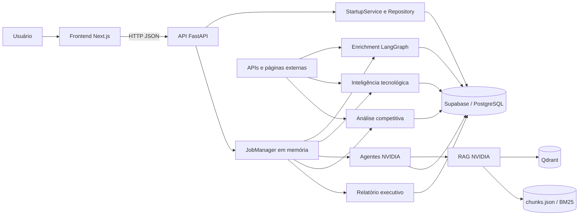
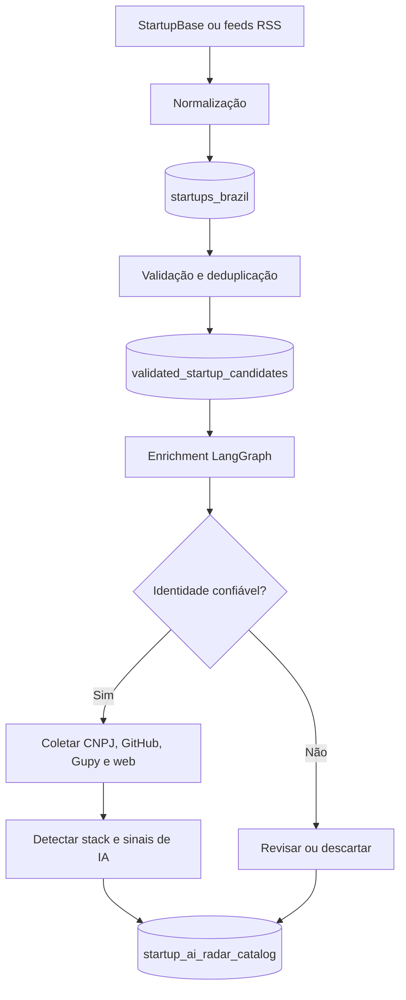
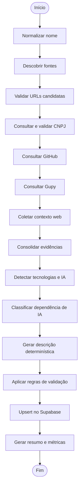
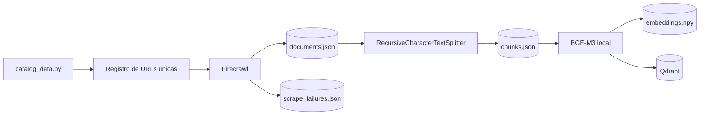
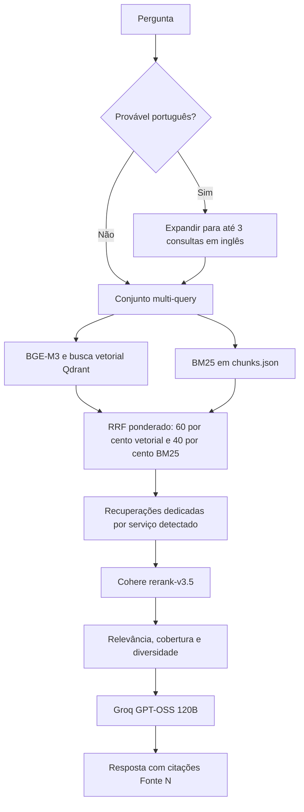
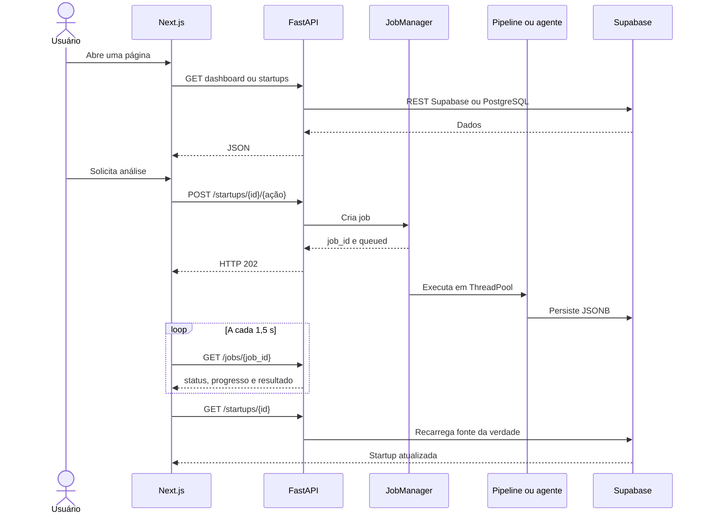
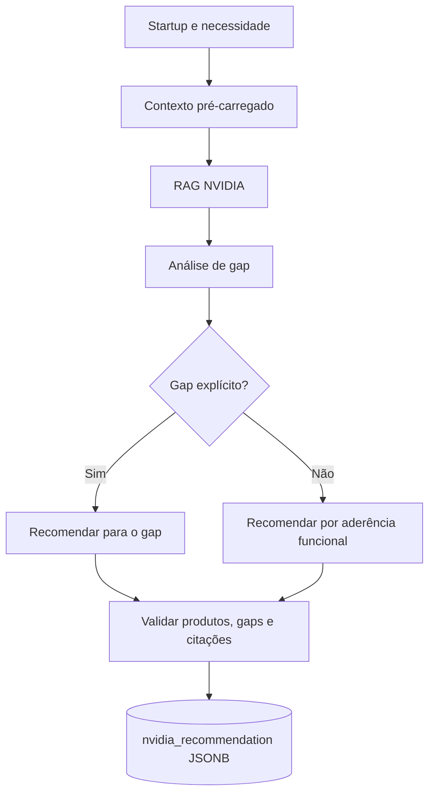
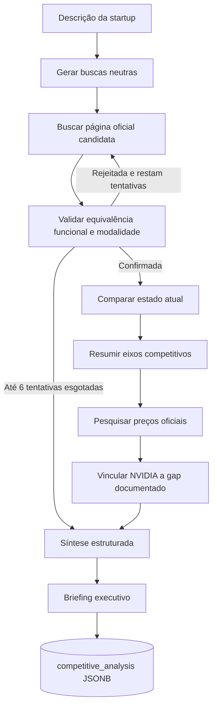
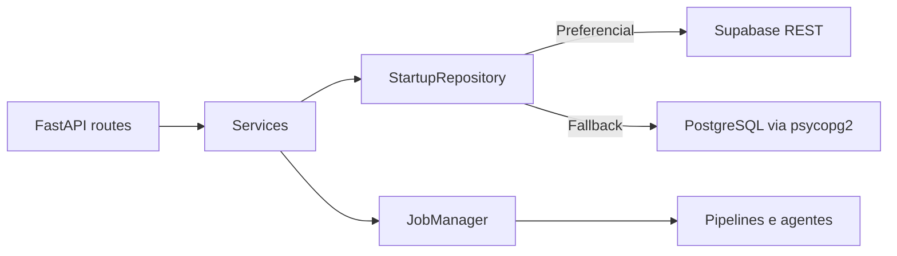
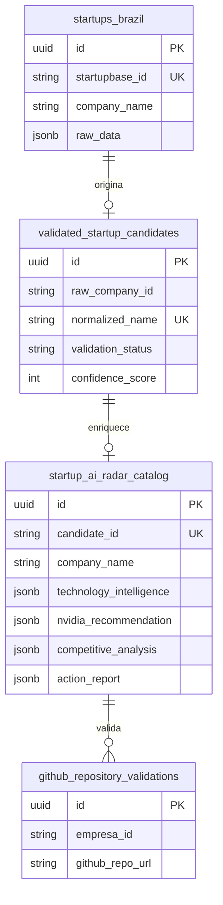

# Arquitetura do Startup AI Radar

Este documento descreve a arquitetura implementada no repositório, o fluxo
completo da aplicação, os modelos usados em cada etapa, as APIs, o frontend, a
persistência e as tecnologias envolvidas.

> Escopo: o conteúdo abaixo foi derivado do código atual. Valores de modelos e
> endpoints são os padrões do projeto e podem ser substituídos por variáveis de
> ambiente.

## 1. Visão geral

O projeto cruza duas bases de conhecimento:

1. um catálogo de startups brasileiras, coletado, validado e enriquecido;
2. um catálogo RAG de produtos e serviços NVIDIA, construído a partir de páginas
   oficiais e documentação técnica.

O usuário acessa um dashboard Next.js. O frontend chama uma API FastAPI, que lê
e grava startups no Supabase/PostgreSQL e dispara análises demoradas em jobs
assíncronos. As recomendações usam um grafo LangGraph e o RAG NVIDIA. As
análises de tecnologia, concorrência e relatórios usam agentes e fontes
externas específicas.



## 2. Componentes e responsabilidades

| Componente | Local | Responsabilidade |
|---|---|---|
| Frontend | `frontend/` | Dashboard, catálogo, perfis, recomendações, comparações e relatórios |
| API | `src/scraper/api/` | Contrato HTTP, CRUD, jobs e adaptação dos pipelines para o frontend |
| Coleta de startups | `src/scraper/startupbase_api/`, `src/scraper/rss_news/` | Descoberta e normalização de candidatos |
| Validação | `src/scraper/validation_pipeline/` | Deduplicação, classificação inicial e gravação de candidatos validados |
| Enrichment | `src/scraper/enrichment_pipeline/` | Identidade, CNPJ, fontes, GitHub, Gupy, stack e classificação de IA |
| Inteligência tecnológica | `src/scraper/market_intelligence/` | Pesquisa web paralela e relatório técnico baseado em evidências |
| Catálogo NVIDIA | `src/rag/catalog_data.py` | Relação de serviços, categorias e URLs NVIDIA |
| Ingestão RAG | `src/rag/scraping/`, `src/rag/ingestion/` | Coleta, chunking, embeddings e carga no Qdrant |
| Recuperação e geração RAG | `src/rag/retrieval/`, `src/rag/generation/` | Busca híbrida, reranking e resposta fundamentada |
| Agentes NVIDIA | `src/agents/nvidia/` | Contexto, gaps, recomendação, briefing e comparação competitiva |
| Agendamento | `scripts/run_scheduled_scan.py` | Descoberta, validação e enrichment incremental |
| Infraestrutura local | `compose.yaml` | Qdrant persistido em `data/qdrant/` |
| Testes | `tests/` | Testes unitários e de integração dos pipelines e da API |

## 3. Fluxo completo da aplicação

### 3.1 Preparação da base de startups

Este fluxo é executado por CLI ou pelo scanner agendado, antes do uso normal do
dashboard.



Passo a passo:

1. `startupbase_api` usa uma API já conhecida ou abre o portal com Playwright
   para observar a chamada JSON interna. Cookies e tokens descobertos são
   transferidos para `httpx`.
2. Como fonte alternativa ou incremental, `rss_news` lê feeds com `feedparser`,
   filtra notícias e extrai nomes candidatos por regras.
3. Os dados brutos normalizados são gravados em `startups_brazil`.
4. `validation_pipeline` normaliza nomes, calcula sinais, deduplica por nome e
   grava `validated_startup_candidates`.
5. `enrichment_pipeline` carrega os candidatos elegíveis e executa um grafo
   LangGraph por empresa.
6. O resultado final é gravado por upsert em
   `startup_ai_radar_catalog`, a tabela consumida pela API.
7. Checkpoints e cache locais permitem retomar processamento em lote.

O script `scripts/run_scheduled_scan.py` encadeia descoberta, validação, seleção
apenas de novos candidatos e enrichment.

### 3.2 Enrichment de uma startup

O grafo atual é sequencial. Alguns nós encerram seu trabalho rapidamente quando
o modo é `identity-only`, quando a fonte não foi validada ou quando uma etapa foi
desabilitada.



Detalhes:

- A descoberta combina URLs já existentes no candidato com busca DuckDuckGo
  via `ddgs`.
- O texto é extraído primeiro com Trafilatura e, como fallback, com
  BeautifulSoup.
- A identidade é validada antes de aceitar uma fonte. URLs de homônimos são
  rejeitadas.
- O CNPJ usa fontes públicas e fallbacks configurados; a resolução ambígua pode
  usar `GROQ_CNPJ_MODEL`.
- O GitHub é consultado pela API oficial e pode inspecionar README e manifests.
- Vagas Gupy são tratadas como sinais, não como prova absoluta de arquitetura.
- A classificação principal de IA e a descrição do grafo atual são baseadas em
  regras/evidências. O helper OpenRouter de `llm_summarize.py` existe, mas não
  está conectado ao `build_enrichment_graph()`.

Modos disponíveis:

| Modo | Comportamento |
|---|---|
| `identity-only` | Descobre e valida identidade/fontes, sem enrichment profundo |
| `deep` | Reutiliza a identidade persistida e executa o enrichment profundo |
| `full` | Executa identidade e enrichment profundo |

### 3.3 Preparação do RAG NVIDIA

Este fluxo também é offline. Ele precisa ser executado antes de uma recomendação
consultar o catálogo.



Passo a passo:

1. `catalog_data.py` define serviços, categorias e URLs.
2. URLs repetidas entre serviços são coletadas uma vez, preservando todas as
   associações.
3. Firecrawl extrai o conteúdo principal em Markdown.
4. Cada sucesso e falha é salvo imediatamente para permitir retomada.
5. `RecursiveCharacterTextSplitter` cria chunks de até 512 caracteres, com
   overlap de 50.
6. `BAAI/bge-m3` gera vetores densos locais de 1.024 dimensões.
7. A collection configurada no Qdrant é recriada e recebe vetores, texto,
   serviços, categorias e URL.
8. Os embeddings intermediários têm checkpoint em arquivo NumPy.

Comandos:

```powershell
python -m rag.scraping.catalog_scraper
python -m rag.ingestion.chunk
python -m rag.ingestion.embed_and_store
```

### 3.4 Consulta ao RAG NVIDIA



Passo a passo:

1. O sistema detecta filtros de serviço/categoria e produtos citados.
2. Perguntas em português são expandidas pelo Groq. Em caso de falha, a busca
   continua apenas com a pergunta original.
3. BGE-M3 gera o embedding da consulta.
4. O Qdrant retorna candidatos semânticos.
5. O índice BM25 em memória retorna candidatos lexicais.
6. Reciprocal Rank Fusion combina os rankings e as variantes de consulta.
7. Consultas comparativas recebem recuperações adicionais por serviço.
8. Cohere `rerank-v3.5` reordena o conjunto combinado.
9. Regras de cobertura e diversidade escolhem o contexto final.
10. `openai/gpt-oss-120b`, via Groq, responde apenas com base nos chunks e
    inclui citações `[Fonte N]`.

### 3.5 Fluxo online do frontend



O `JobManager` usa `ThreadPoolExecutor`. Os estados são `queued`, `running`,
`completed` e `failed`. O histórico fica em memória e é perdido quando a API
reinicia. A interface `JobStore` é a fronteira prevista para uma futura troca
por Redis/RQ ou outro backend durável.

### 3.6 Recomendação NVIDIA para uma startup

O frontend envia uma necessidade opcional. O backend pré-carrega o contexto da
startup e executa o grafo NVIDIA em modo `recommendation`.



Regras importantes:

- uma necessidade escrita pelo usuário vira um gap documentado;
- sem gap, o resultado é marcado como oportunidade de aderência funcional, não
  como deficiência comprovada;
- produtos sem evidência no contexto RAG são descartados;
- citações inválidas são descartadas;
- o resultado é persistido em `startup_ai_radar_catalog.nvidia_recommendation`.

### 3.7 Análise competitiva



O fluxo usa apenas domínios oficiais permitidos para validar o concorrente. A
comparação separa:

- estado atual da startup;
- produto atual da big tech;
- estado futuro, representado por uma recomendação NVIDIA.

Sem gap explícito, a etapa de alavancagem NVIDIA não é executada. Preços não são
estimados: na ausência de página oficial, o resultado informa indisponibilidade.

### 3.8 Inteligência tecnológica

Ao abrir um perfil sem relatório persistido, o frontend dispara
automaticamente `technology-intelligence`.

1. O agente monta buscas para vagas, Gupy, LinkedIn, GitHub, StackShare,
   engenharia, cloud, linguagens e IA.
2. Até seis buscas são processadas em paralelo e até 12 páginas únicas são
   coletadas por padrão.
3. Fontes que não correspondem à empresa são removidas.
4. O modelo OpenRouter recebe evidências numeradas.
5. Todo achado sem um ID de evidência válido é descartado.
6. O resultado é salvo em `technology_intelligence` no Supabase.

### 3.9 Relatório executivo

O relatório exige uma recomendação NVIDIA já persistida. A análise competitiva
é opcional.

1. O usuário escolhe startup, produto/objetivo e perfil desejado.
2. FastAPI cria um job `action-report`.
3. O serviço agrega cadastro, inteligência tecnológica, recomendação NVIDIA e
   comparação competitiva.
4. OpenRouter gera JSON com Markdown executivo, score, riscos, próximos passos
   e confiabilidade.
5. O resultado é salvo em `action_report`.
6. O frontend gera o arquivo PDF diretamente no navegador, sem biblioteca ou
   serviço externo de PDF.

## 4. Modelos de IA e onde são usados

### 4.1 Modelos generativos

| Etapa | Provedor | Modelo padrão | Variável | Observação |
|---|---|---|---|---|
| Expansão da consulta RAG | Groq | `llama-3.3-70b-versatile` | `GROQ_QUERY_EXPANSION_MODEL` | Até 3 consultas técnicas em inglês; fallback para a consulta original |
| Resposta final do RAG | Groq | `openai/gpt-oss-120b` | `GROQ_CHAT_MODEL` | Gera resposta com contexto recuperado e citações |
| Recomendação genérica, sem startup | Groq | `llama-3.3-70b-versatile` | `GROQ_RECOMMENDATION_MODEL` | Caminho do CLI quando não há contexto de startup |
| Gaps, fit de startup e agentes competitivos | Groq | `llama-3.3-70b-versatile` | `GROQ_COMPETITIVE_MODEL` | Helper JSON compartilhado; é o caminho usado pela recomendação iniciada no frontend |
| Briefing final | Groq | `qwen/qwen3-32b` | `GROQ_BRIEFING_MODEL` | Usado no modo briefing e ao final da análise competitiva |
| Resolução de CNPJ ambíguo | Groq | `llama-3.3-70b-versatile` | `GROQ_CNPJ_MODEL` | Só é acionado quando as fontes cadastrais exigem desambiguação |
| Inteligência tecnológica | OpenRouter | `openai/gpt-oss-120b` | `TECH_INTELLIGENCE_MODEL` | Organiza apenas evidências numeradas |
| Correção/sumarização auxiliar de catálogo | OpenRouter | `openai/gpt-oss-20b:free` | `OPENROUTER_MODEL` | Fallbacks em `OPENROUTER_FALLBACK_MODELS`; não é um nó do grafo principal atual |
| Relatório executivo | OpenRouter | `~google/gemini-flash-latest` | `REPORT_OPENROUTER_MODEL` | Fallbacks: Gemini 2.5 Flash e Flash Lite por padrão |
| Juiz da avaliação RAGAS | Groq, API compatível OpenAI | `openai/gpt-oss-120b` | `RAGAS_JUDGE_MODEL` | Usado apenas na avaliação offline |

Observação: no endpoint de recomendação de startup, o grafo usa
`call_json()` e, portanto, `GROQ_COMPETITIVE_MODEL`. O
`GROQ_RECOMMENDATION_MODEL` atende o caminho genérico sem startup.

### 4.2 Modelos de recuperação

| Função | Modelo | Execução |
|---|---|---|
| Embedding de documentos e consultas | `BAAI/bge-m3` | Local com FlagEmbedding; FP16 quando CUDA está disponível |
| Busca lexical | BM25 | Local com `rank-bm25` |
| Fusão | Weighted RRF | Algoritmo local |
| Reranking | Cohere `rerank-v3.5` | API Cohere |

BGE-M3 e Cohere Rerank não geram texto; eles selecionam e ordenam evidências.

## 5. API FastAPI

Base local padrão: `http://127.0.0.1:8000`.

Documentação automática:

- Swagger UI: `/docs`
- OpenAPI: `/openapi.json`

### 5.1 Endpoints

| Método | Endpoint | Execução | Resultado persistido |
|---|---|---|---|
| `GET` | `/health` | Síncrona | Não |
| `GET` | `/dashboard/summary` | Síncrona | Não |
| `POST` | `/startups` | Síncrona | Nova linha no catálogo |
| `GET` | `/startups` | Síncrona | Não |
| `GET` | `/startups/{id}` | Síncrona | Não |
| `PATCH` | `/startups/{id}` | Síncrona | Atualiza o catálogo |
| `DELETE` | `/startups/{id}` | Síncrona | Exclui somente da tabela configurada da API |
| `POST` | `/startups/{id}/identity-check` | Job | Identidade/enrichment |
| `POST` | `/startups/{id}/enrich` | Job | Enrichment completo |
| `POST` | `/startups/{id}/company-registration` | Job | CNPJ e dados cadastrais |
| `POST` | `/startups/{id}/technology-intelligence` | Job | `technology_intelligence` |
| `POST` | `/startups/{id}/nvidia-recommendation` | Job | `nvidia_recommendation` |
| `POST` | `/startups/{id}/competitive-analysis` | Job | `competitive_analysis` |
| `POST` | `/startups/{id}/action-report` | Job | `action_report` |
| `GET` | `/jobs/{job_id}` | Síncrona | Não |

Filtros de `GET /startups`:

- `page` e `page_size`;
- `search`;
- `validation_status`;
- `enrichment_status`;
- `ai_classification`;
- `has_nvidia_recommendation`.

Jobs retornam HTTP 202:

```json
{
  "job_id": "uuid",
  "status": "queued"
}
```

O frontend consulta `/jobs/{job_id}` até `completed` ou `failed`.

### 5.2 Camadas internas



O repositório usa Supabase REST quando `SUPABASE_URL` e `SUPABASE_KEY` estão
presentes. Sem essas credenciais, usa `DATABASE_URL`.

## 6. Frontend

### 6.1 Rotas

| Rota | Tela | Dados/ações principais |
|---|---|---|
| `/` | Visão geral | `GET /dashboard/summary` |
| `/startups` | Catálogo | Busca, paginação e filtros via `GET /startups` |
| `/startups/{id}` | Perfil | Cadastro, stack, revisão e recomendação NVIDIA |
| `/big-techs` | Comparação | Seleção de startup e job de análise competitiva |
| `/recomendacoes` | Recomendações salvas | Lista startups com `nvidia_recommendation` |
| `/relatorios` | Relatório executivo | Geração e exportação de relatório em PDF |

### 6.2 Estado e comunicação

- TanStack Query controla cache, loading, retry e polling.
- O cache padrão fica válido por 30 segundos.
- Jobs são consultados a cada 1,5 segundo; alguns dados persistidos são
  recarregados a cada 2 segundos durante processamento.
- Cada requisição comum tem timeout de 20 segundos.
- `NEXT_PUBLIC_API_URL` é a única configuração pública necessária.
- Não há fallback com mocks.
- O nome pedido ao abrir a interface é salvo em `sessionStorage` e usado nos
  relatórios. Isso é identificação de interface, não autenticação nem
  autorização.
- Logos podem ser carregados no navegador por Clearbit, Google Favicons e
  DuckDuckGo Icons.

### 6.3 Segurança de configuração

Somente `NEXT_PUBLIC_API_URL` deve chegar ao browser. Estas credenciais devem
permanecer no backend:

- `SUPABASE_KEY` e `DATABASE_URL`;
- `GROQ_API_KEY`;
- `OPENROUTER_API_KEY`;
- `COHERE_API_KEY`;
- `FIRECRAWL_API_KEY`;
- `GITHUB_TOKEN`;
- `BRASIL_IO_API_TOKEN`.

O CORS permite, por padrão, `localhost:3000` e `127.0.0.1:3000`. A API atual não
implementa autenticação. Em produção, autenticação/autorização e restrição de
CORS precisam ser adicionadas antes de expor endpoints de escrita.

## 7. Persistência e dados



As relações são lógicas; parte das ligações usa identificadores textuais e não
foreign keys no schema atual.

Outros artefatos:

| Artefato | Função |
|---|---|
| `data/raw/documents.json` | Documentos NVIDIA coletados |
| `data/raw/scrape_failures.json` | Falhas pendentes da coleta |
| `data/processed/chunks.json` | Chunks e metadados usados também pelo BM25 |
| `data/processed/embeddings.npy` | Checkpoint dos vetores |
| `data/processed/embeddings_state.json` | Progresso da geração de embeddings |
| `data/qdrant/` | Volume local do Qdrant |
| `data/evaluation/` | Casos e execuções RAGAS |

Supabase/PostgreSQL é a fonte da verdade das startups. Qdrant e os arquivos em
`data/` são a fonte de recuperação do catálogo NVIDIA.

## 8. Serviços externos

| Serviço | Uso |
|---|---|
| Supabase REST / PostgreSQL | Persistência principal |
| Qdrant | Banco vetorial |
| Firecrawl | Coleta do catálogo NVIDIA |
| Groq | Inferência dos agentes NVIDIA, RAG e desambiguação de CNPJ |
| OpenRouter | Inteligência tecnológica, correções auxiliares e relatório |
| Cohere | Reranking dos chunks |
| StartupBase | Fonte de startups quando endpoint/portal válido é configurado |
| Feeds RSS | Descoberta incremental de candidatos |
| DuckDuckGo via `ddgs` | Descoberta de fontes, vagas e concorrentes |
| GitHub API | Organizações, repositórios, README e manifests |
| Brasil.io | Busca cadastral de empresas |
| BrasilAPI | Consulta de CNPJ |
| publica.cnpj.ws | Busca/consulta de CNPJ configurável |
| cnpj.biz | Fallback de busca cadastral |
| cnpja.com | Correção auxiliar do catálogo |

## 9. Tecnologias utilizadas

### Backend e dados

- Python;
- FastAPI e Uvicorn;
- Pydantic, por meio dos schemas FastAPI;
- LangGraph;
- Groq SDK;
- LangChain OpenAI e LangChain Text Splitters;
- httpx e requests;
- python-dotenv;
- Supabase e PostgreSQL;
- psycopg2;
- Qdrant e qdrant-client;
- FlagEmbedding/BGE-M3;
- PyTorch;
- NumPy;
- rank-bm25;
- Cohere SDK;
- Firecrawl SDK;
- Playwright;
- Trafilatura, lxml e BeautifulSoup;
- `ddgs`;
- feedparser;
- pypdf;
- RAGAS, Datasets e LangChain Community para avaliação opcional.

### Frontend

- Next.js 14 com App Router;
- React 18;
- TypeScript;
- Tailwind CSS;
- padrão de componentes shadcn/ui;
- Radix UI Slot;
- TanStack Query;
- TanStack Table;
- Recharts;
- Lucide React;
- `class-variance-authority`, `clsx` e `tailwind-merge`;
- PostCSS e Autoprefixer.

### Infraestrutura e qualidade

- Docker Compose;
- Qdrant em container;
- pytest;
- ESLint;
- TypeScript `tsc`;
- Git.

## 10. Configuração e execução

### 10.1 Pré-requisitos

- Python compatível com as dependências;
- Node.js e npm;
- Docker com Compose;
- PostgreSQL/Supabase configurado;
- chaves dos serviços usados pelo fluxo escolhido.

### 10.2 Instalação do backend

```powershell
python -m venv .venv
.\.venv\Scripts\python.exe -m pip install -r requirements\scraping.txt
.\.venv\Scripts\python.exe -m pip install -r requirements\embedding.txt
.\.venv\Scripts\python.exe -m pip install -r requirements\api.txt
$env:PYTHONPATH = "src"
```

Copie `.env.example` para `.env` e preencha apenas segredos reais no `.env`.

### 10.3 Inicialização

```powershell
docker compose up -d
.\.venv\Scripts\python.exe -m scraper.api.main
```

Em outro terminal:

```powershell
Set-Location frontend
npm install
npm run dev
```

Endereços padrão:

- frontend: `http://localhost:3000`;
- API: `http://127.0.0.1:8000`;
- Swagger: `http://127.0.0.1:8000/docs`;
- Qdrant HTTP: `http://localhost:6333`.

### 10.4 Verificações

```powershell
.\.venv\Scripts\python.exe -m pytest
Set-Location frontend
npm run typecheck
npm run build
```

## 11. Limitações arquiteturais atuais

1. Jobs não são duráveis e desaparecem após reinício da API.
2. Não há autenticação nem autorização na API.
3. O nome em `sessionStorage` não representa uma sessão segura.
4. O Qdrant é o único serviço definido no Compose; API e frontend são iniciados
   fora de containers.
5. O frontend usa polling, não WebSocket ou Server-Sent Events.
6. O índice BM25 é reconstruído em memória a partir de `chunks.json`.
7. A collection Qdrant é recriada durante a ingestão completa.
8. A API e vários pipelines fazem chamadas síncronas; o paralelismo de jobs é
   baseado em threads.
9. As tabelas têm relações lógicas sem integridade referencial completa.
10. A qualidade depende da disponibilidade e dos termos de uso das fontes
    externas.

## 12. Mapa rápido de código

```text
frontend/
├── app/                         rotas Next.js
├── components/                  telas, gráficos e componentes
└── lib/api.ts                   cliente HTTP central

src/
├── agents/nvidia/
│   ├── graph.py                 grafo principal
│   └── competitive/graph.py     grafo competitivo
├── rag/
│   ├── catalog_data.py          catálogo NVIDIA
│   ├── scraping/                Firecrawl
│   ├── ingestion/               chunks, embeddings e Qdrant
│   ├── retrieval/               BGE-M3, BM25, RRF e Cohere
│   └── generation/              resposta Groq
└── scraper/
    ├── api/                     FastAPI, serviços, jobs e repositórios
    ├── startupbase_api/         coleta StartupBase
    ├── rss_news/                descoberta RSS
    ├── validation_pipeline/     validação inicial
    ├── enrichment_pipeline/     grafo de enrichment
    └── market_intelligence/     agente de stack tecnológica
```
